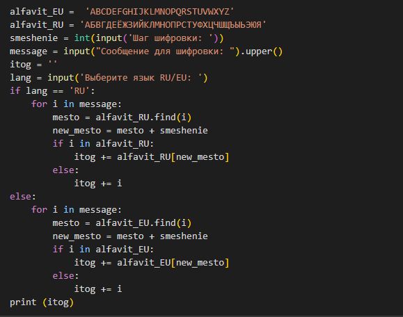
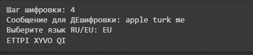
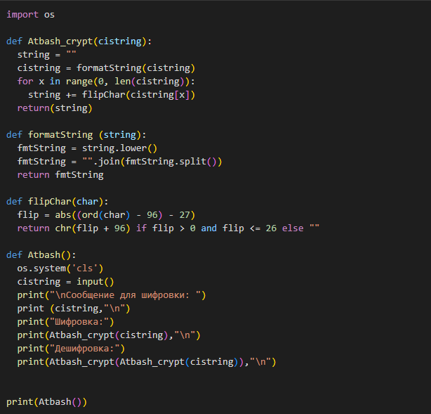
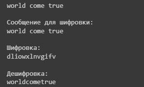

---
## Front matter
lang: ru-RU
title: Лабораторная работа №1
subtitle: Математические основы защиты информации и информационной безопасности
author:
  - Царитова Нина Аведиковна
institute:
  - Российский университет дружбы народов имени Патриса Лумумбы, Москва, Россия
  - НФИмд-02-23

## i18n babel
babel-lang: russian
babel-otherlangs: english

## Formatting pdf
toc: false
toc-title: Содержание
slide_level: 2
aspectratio: 169
section-titles: true
theme: metropolis
header-includes:
 - \metroset{progressbar=frametitle,sectionpage=progressbar,numbering=fraction}
 - '\makeatletter'
 - '\beamer@ignorenonframefalse'
 - '\makeatother'
---

# Шифры простой замены. Шифр Цезаря и шифр Атбаш

## Цель лабораторной работы

1. Ознакомление с двумя методами шифрования: шифр Цезаря с произвольным ключем k и шифр Атбаш.
2. Их реализация на произвольном языке программирования.

## Задачи лабораторной работы

1. Реализовать шифр Цезаря с произвольным ключем
2. Реализовать шифр Атбаша.

## Выполнение

В соответсвии с заданием, была написана программа для шифра Цезаря. Код представлен ниже.
  
{ #fig:1 width=30% }

## Выполнение

Результаты выполнения программы прдеставленны ниже.
  
{ #fig:2 width=50% }

## Выполнение

В соответсвии с заданием, была написана программа для шифра Атбаш. Код представлен ниже. 

{ #fig:3 width=50% }

## Выполнение

Результаты выполнения программы прдеставленны ниже.
  
{ #fig:4 width=50% }

## Выводы
 * Я ознакомилась с помощью Python с двумя методами шифровки: Цезарь и Атбаш.
 * Реализовала эти шифры на Python.

 
  
  

