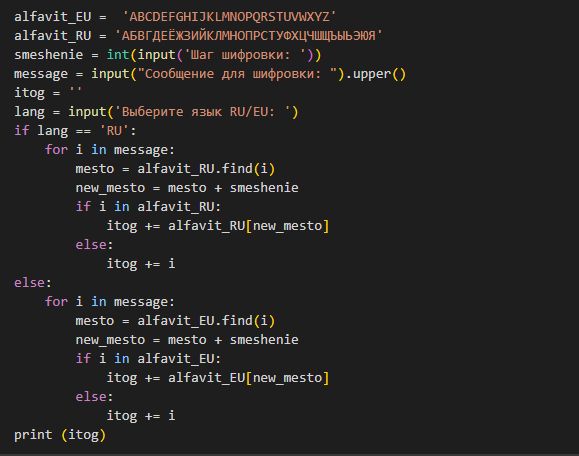
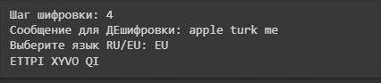
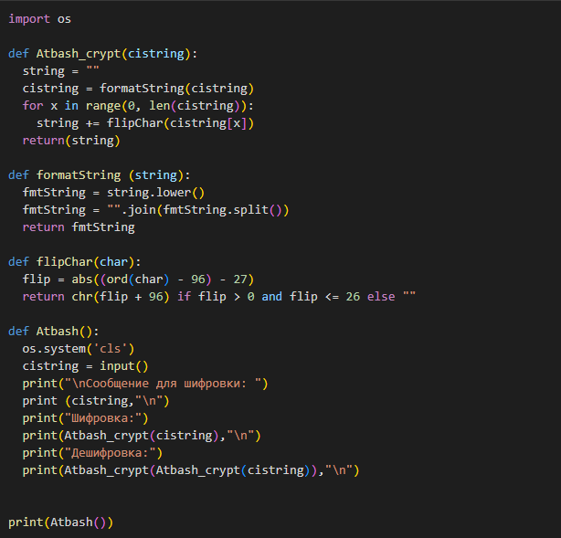
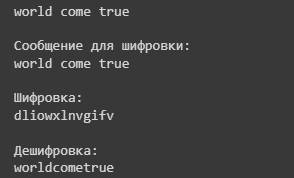

---
## Front matter
title: "Лабораторная работа №1"
subtitle: "Математические основы защиты информации и информационной безопасности"
author: "Царитова Нина Аведиковна"

## Generic otions
lang: ru-RU
toc-title: "Содержание"

## Bibliography
bibliography: bib/cite.bib
csl: pandoc/csl/gost-r-7-0-5-2008-numeric.csl

## Pdf output format
toc: true # Table of contents
toc-depth: 2
lof: true # List of figures
lot: true # List of tables
fontsize: 12pt
linestretch: 1.5
papersize: a4
documentclass: scrreprt
## I18n polyglossia
polyglossia-lang:
  name: russian
  options:
	- spelling=modern
	- babelshorthands=true
polyglossia-otherlangs:
  name: english
## I18n babel
babel-lang: russian
babel-otherlangs: english
## Fonts
mainfont: PT Serif
romanfont: PT Serif
sansfont: PT Sans
monofont: PT Mono
mainfontoptions: Ligatures=TeX
romanfontoptions: Ligatures=TeX
sansfontoptions: Ligatures=TeX,Scale=MatchLowercase
monofontoptions: Scale=MatchLowercase,Scale=0.9
## Biblatex
biblatex: true
biblio-style: "gost-numeric"
biblatexoptions:
  - parentracker=true
  - backend=biber
  - hyperref=auto
  - language=auto
  - autolang=other*
  - citestyle=gost-numeric
## Pandoc-crossref LaTeX customization
figureTitle: "Рис."
tableTitle: "Таблица"
listingTitle: "Листинг"
lofTitle: "Список иллюстраций"
lolTitle: "Листинги"
## Misc options
indent: true
header-includes:
  - \usepackage{indentfirst}
  - \usepackage{float} # keep figures where there are in the text
  - \floatplacement{figure}{H} # keep figures where there are in the text
---

# Цель работы

# Задание

1. Реализовать шифр Цезаря с произвольным ключем
2. Реализовать шифр Атбаша.

# Теоретическое введение

Математическая часть подробно описана в задании к лабораторной работе. Я поставила перед собой задачу найти факты о методах шифрования.
В основе функционирования шифров простой замены лежит следящий принцип: для получения шифртекста отдельные символы или группы символов исходного алфавита заменяются символами или группами символов шифралфавита.
Шифр Цезаря – (также он является шифром простой замены) – это моноалфавитная подстановка, т.е. каждой букве открытого текста ставится в соответствие одна буква шифртекста. На практике при создании шифра простой замены в качестве шифроалфавита берется исходный алфавит, но с нарушенным порядком букв (алфавитная перестановка). Для запоминания нового порядка букв перемешивание алфавита осуществляется с помощью пароля. В качестве пароля могут выступать слово или несколько слов с неповторяющимися буквами. Шифровальная таблица состоит из двух строк: в первой записывается стандартный алфавит открытого текста, во второй- начиная с некоторой позиции размещается пароль (пробелы опускаются), а далее идут в алфавитном порядке оставшиеся буквы, не вошедшие в пароль. В случае несовпадения начала пароля с началом строки процесс после ее завершения циклически продолжается с первой позиции. Ключом шифра служит пароль вместе с числом, указывающим положение начальной буквы пароля. Таблица шифрования на ключе 4 пароль будет иметь вид:
а б в г д е ж з и й к л м н о п р с т у ф х ц ч ш щ ъ ы ь э ю я
ы э ю я п а р о л ь б в г д е ж з и й к м н с т у ф х ц ч ш щ ъ
Шрифт Атбаш является шифром сдвига на всю длину алфавита. Для алфавита, состоящего только из русских букв и пробела, таблица шифрования будет иметь следующий вид:
 а б в г д е ж з и й к л м н о п р с т у ф х ц ч ш щ ъ ы ь э ю я _
_ ы э ю я п а р о л ь б в г д е ж з и й к м н с т у ф х ц ч ш щ ъ

# Выполнение лабораторной работы

## Шифр Цезаря

В соответсвии с заданием, была написана программа для шифра Цезаря. Код представлен ниже.

{ #fig:1 width=70% }

Результаты выполнения программы прдеставленны ниже.

{ #fig:2 width=70% }

## Шифр Атбаш

В соответсвии с заданием, была написана программа для шифра Атбаш. Код представлен ниже.

{ #fig:3 width=70% }

Результаты выполнения программы прдеставленны ниже.

{ #fig:4 width=70% }

# Выводы

1. Я ознакомилась с помощью питона с двумя методами шифровки: Цезарь и Атбаш.
2. Реализовала эти шифры на питоне.

# Список литературы

1. Википедия. Шифр простой замены. https://ru.wikipedia.org/wiki/Атбаш

2. Википедия. Шифр Цезаря.https://ru.wikipedia.org/wiki/%D0%A8%D0%B8%D1%84%D1%80_%D0%A6%D0%B5%D0%B7%D0%B0%D1%80%D1%8F#:%7E:text=%D0%A8%D0%B8%D1%84%D1%80%20%D0%A6%D0%B5%D0%B7%D0%B0%D1%80%D1%8F%20%E2%80%94%20%D1%8D%D1%82%D0%BE%20%D0%B2%D0%B8%D0%B4%20%D1%88%D0%B8%D1%84%D1%80%D0%B0%2C%D1%81%D1%82%D0%B0%D0%BD%D0%B5%D1%82%20%D0%94%2C%20%D0%B8%20%D1%82%D0%B0%D0%BA%20%D0%B4%D0%B0%D0%BB%D0%B5%D0%B5 

3. Википедия. Шифр Атбаш. https://ru.wikipedia.org/wiki/Шифр_Цезаря

::: {#refs}
:::
