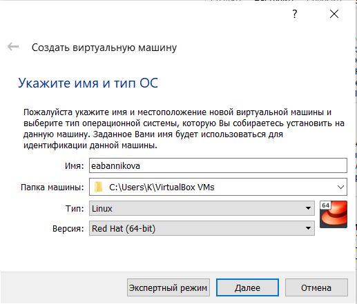
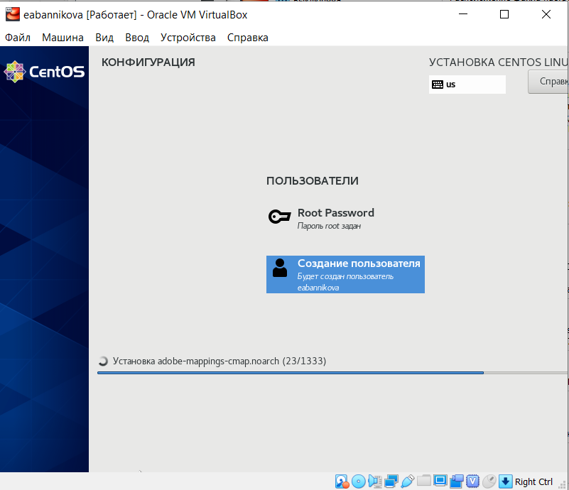
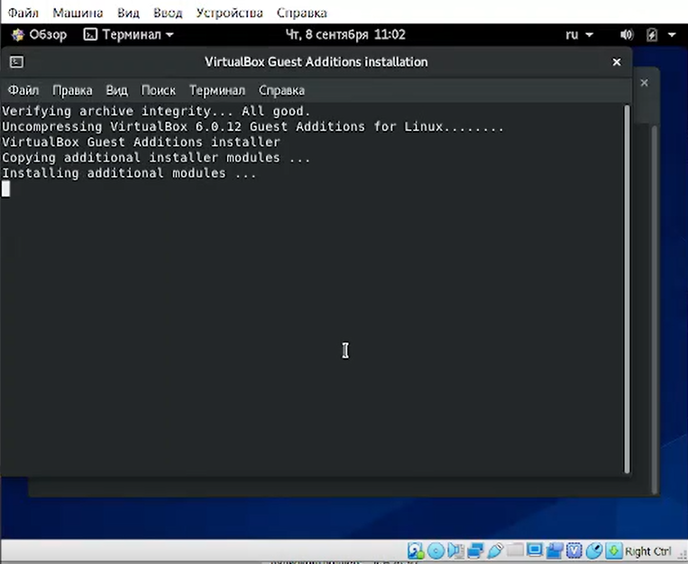

---
## Front matter
lang: ru-RU
title: Лабораторная №1
subtitle: Основы информационной безопасности
author:
  - Банникова Екатерина Алексеевна
institute:
  - Российский университет дружбы народов, Москва, Россия
  - НПМбд-01-19

## i18n babel
babel-lang: russian
babel-otherlangs: english

## Formatting pdf
toc: false
toc-title: Содержание
slide_level: 2
aspectratio: 169
section-titles: true
theme: metropolis
header-includes:
 - \metroset{progressbar=frametitle,sectionpage=progressbar,numbering=fraction}
 - '\makeatletter'
 - '\beamer@ignorenonframefalse'
 - '\makeatother'
---

# Установка  OC Linux на виртуальную машину

## Цель лабораторной работы

1. Приобретение практических навыков установки операционной системы на виртуальную машину.
2. Настройка минимально необходимых для дальнейшей работы сервисов.

## Задачи лабораторной работы

1. Установить операционную систему Linux на виртуальную машину.
2. Устанвоить дополнения для дальнейшей работы.

## Выполнение
 Создала виртуальную машину в VirtualBox
  
{ #fig:1 width=50% }

## Выполнение
  Настройка виртуальной машины
  
{ #fig:2 width=50% }

## Выполнение
  Установка операционной системы
  
{ #fig:8 width=50% }

## Выполнение
  Настройка операционной системы
  
{ #fig:10 width=50% }

## Выполнение
  Установка дополнений гостевой ОС
  
{ #fig:12 width=50% }

## Выводы
 * Я приобрела практические навыки установки операционной системы на виртуальную машину.
 * Настроила минимально необходимые для дальнейшей работы сервисы.

 
  
  

