---
## Front matter
lang: ru-RU
title: |
    Лабораторная работа №2.  
    Шифры перестановки
author: |
    *Математические основы защиты информации*  
    *и информационной безопасности*  
    \vspace{2pt}
    **Студентка:** Царитова Нина Аведиковна  
		**Группа:** НФИмд-02-23  
		**Преподаватель:** д-р.ф.-м.н., проф. Кулябов Дмитрий Сергеевич
    \vspace{2pt}

## Formatting
toc: false
slide_level: 2
theme: metropolis
header-includes:
 - \metroset{progressbar=frametitle,sectionpage=progressbar,numbering=fraction}
 - '\makeatletter'
 - '\beamer@ignorenonframefalse'
 - '\makeatother'
aspectratio: 43
section-titles: true
linestretch: 1.25

mainfont: PT Serif
romanfont: PT Serif
sansfont: PT Sans
monofont: PT Mono
mainfontoptions: Ligatures=TeX
romanfontoptions: Ligatures=TeX
sansfontoptions: Ligatures=TeX,Scale=MatchLowercase
monofontoptions: Scale=MatchLowercase,Scale=0.7
---

# Цели и задачи работы

## Цель лабораторной работы

Ознакомление с тремя методами шифрования: маршрутным шифрованием, шифрованием с помощью решеток, таблицей Виженера, -- а так же их реализация на произвольном языке программирования.

## Задание

Реализовать рассмотренные в документе-объяснению к лабораторной работе шрифты программно.

# Ход выполнения и результаты

## Реализация

Импортировали необходимые в лабораторной работе библиотеки.
```python
import numpy as np
from collections import dequ
```

## Маршрутное шифрование
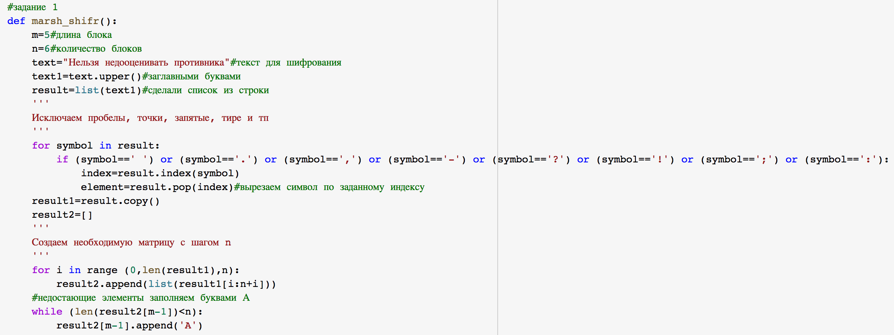{ #fig:001 width=70% }

## Маршрутное шифрование
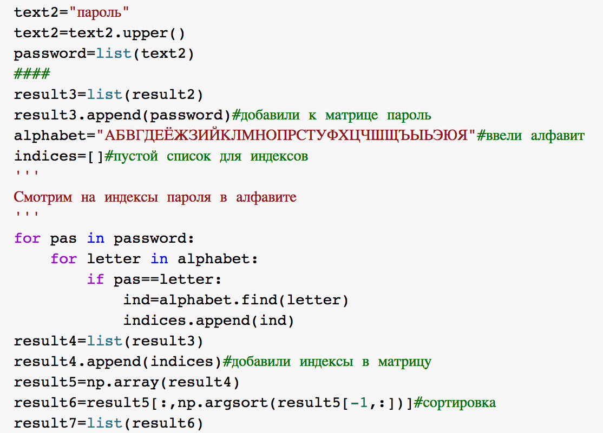{ #fig:002 width=70% }

## Маршрутное шифрование
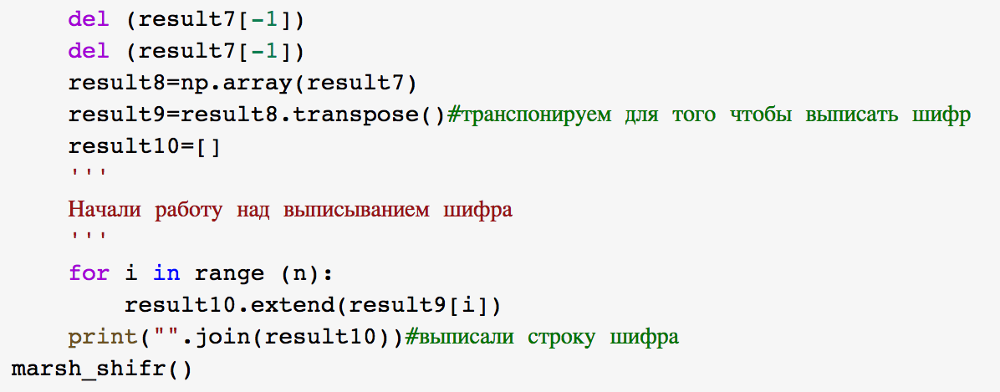{ #fig:003 width=70% }

## Маршрутное шифрование
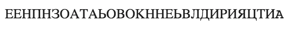{ #fig:004 width=70% }

## Шифрование с помощью решеток
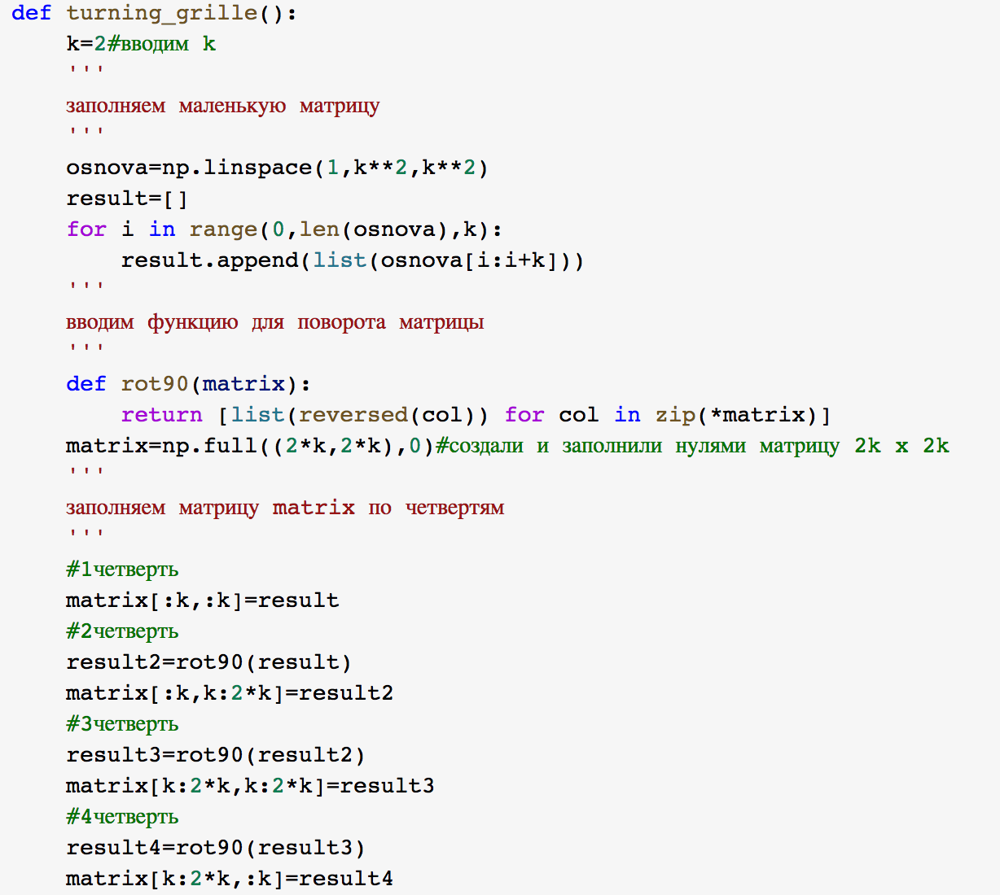{ #fig:005 width=70% }

## Шифрование с помощью решеток
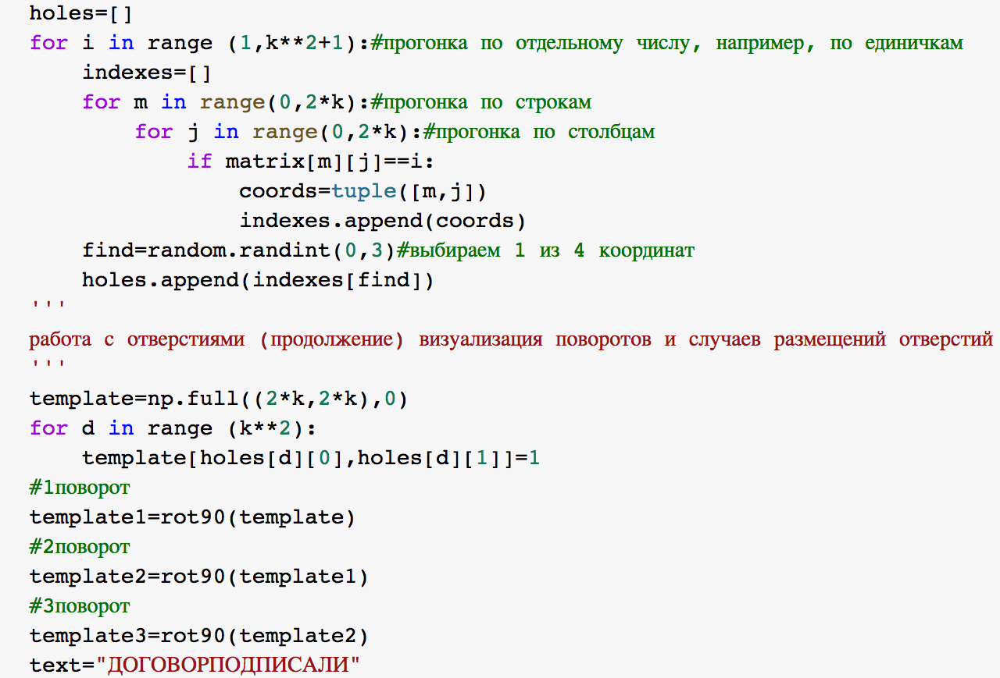{ #fig:006 width=70% }

## Шифрование с помощью решеток
{ #fig:007 width=70% }

## Шифрование с помощью решеток
{ #fig:008 width=70% }

## Шифрование с помощью решеток
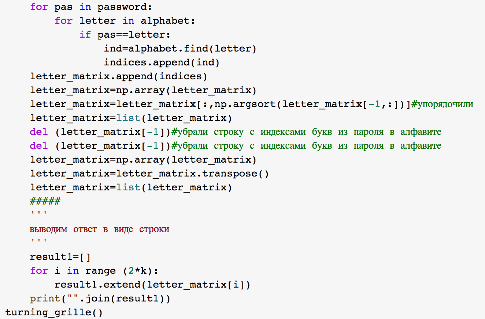{ #fig:009 width=70% }

## Шифрование с помощью решеток
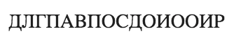{ #fig:010 width=70% }

## Таблица Виженера
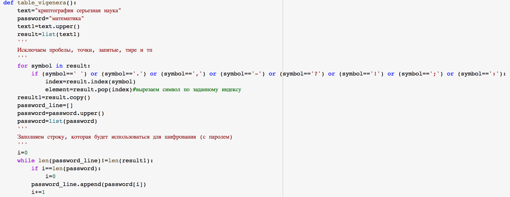{ #fig:011 width=70% }

## Таблица Виженера
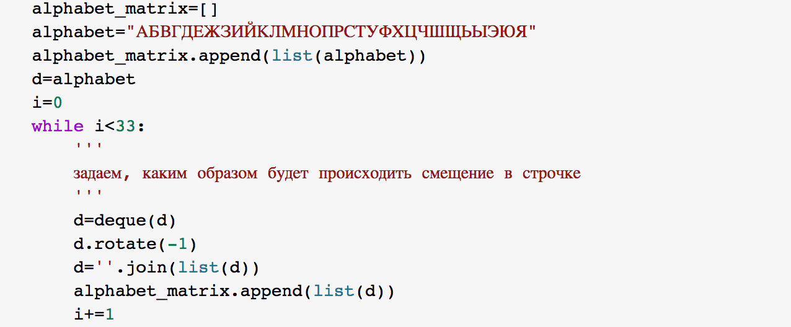{ #fig:012 width=70% }

## Таблица Виженера
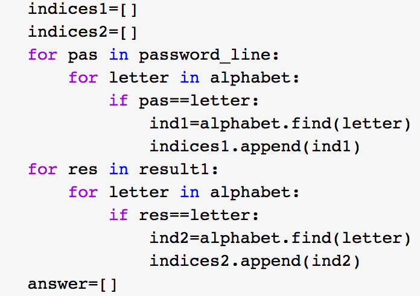{ #fig:013 width=70% }

## Таблица Виженера
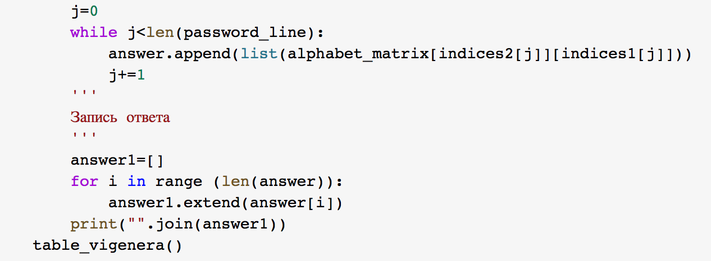{ #fig:014 width=70% }

## Таблица Виженера
{ #fig:014 width=70% }

## {.standout}

Спасибо за внимание
