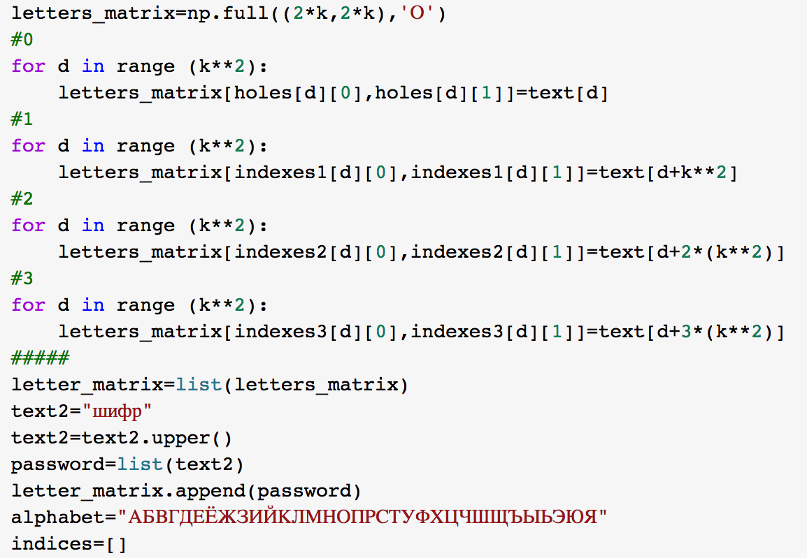

---
## Front matter
lang: ru-RU
title: Лабораторная №2
subtitle: Основы информационной безопасности
author:
  - Банникова Екатерина Алексеевна
institute:
  - Российский университет дружбы народов, Москва, Россия
  - НПМбд-01-19

## i18n babel
babel-lang: russian
babel-otherlangs: english

## Formatting pdf
toc: false
toc-title: Содержание
slide_level: 2
aspectratio: 169
section-titles: true
theme: metropolis
header-includes:
 - \metroset{progressbar=frametitle,sectionpage=progressbar,numbering=fraction}
 - '\makeatletter'
 - '\beamer@ignorenonframefalse'
 - '\makeatother'
---

# Дискреционное разграничение прав в Linux. Основные атрибуты

## Цель лабораторной работы

1. Получение практических навыков работы с атрибутами файлов.
2. Закрепление теоретических основ дискреционного разграничения доступа в современных системах с открытым кодом на базе OC Linux.

## Задачи лабораторной работы

1. Создать новую учетную запись
2. Работа с атрибутами

## Выполнение

Создание новой учетной записи
  
{ #fig:1 width=80% }

## Выполнение
  
Уточнение имени пользователя, id, /etc/passwd
  
{ #fig:2 width=80% }

## Выполнение
  
Работа с атрибутами, проверка доступа
  
{ #fig:3 width=80% }

## Выполнение
  
Уставновленные права и разрешенные действия
  
{ #fig:4 width=70% }

## Выполнение

Минимальные права для совершения операций
  
{ #fig:5 width=70% }

## Выводы

1. Получила практические навыки работы в консоли с атрибутами файлов.
2. Закрепила теоретические основы дискреционного разграничения доступа в современных системах с открытым кодом на базе OC Linux.

 
  
  

