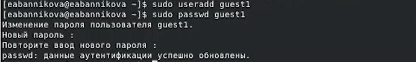
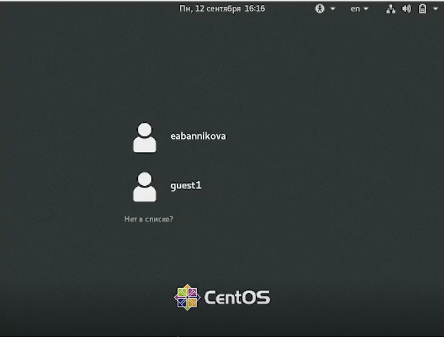
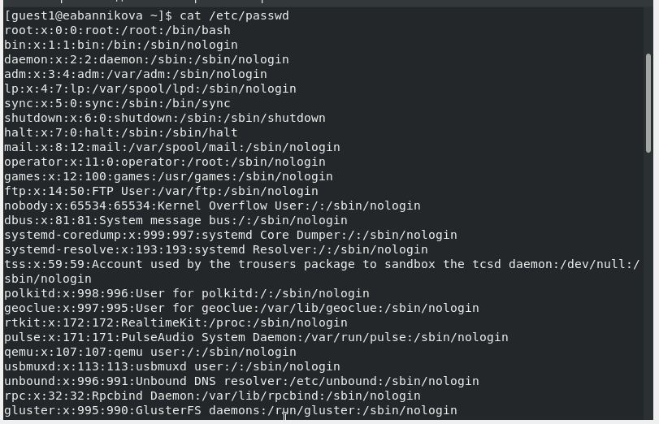
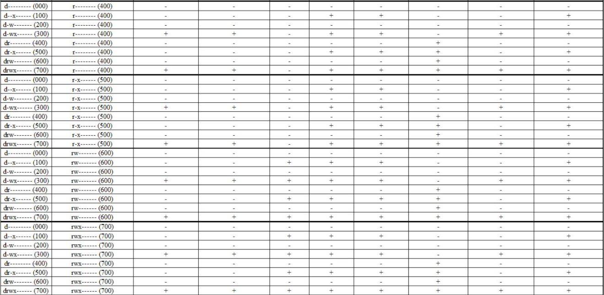
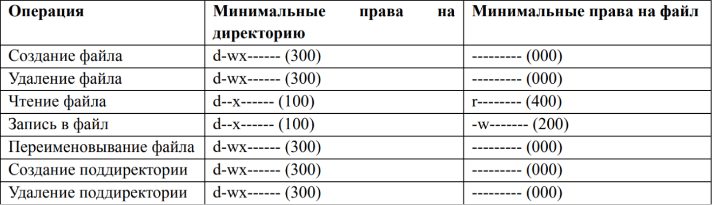

---
## Front matter
title: "Лабораторная работа №2"
subtitle: "Информационная безопасность"
author: "Банникова Екатерина Алексеевна"

## Generic otions
lang: ru-RU
toc-title: "Содержание"

## Bibliography
bibliography: bib/cite.bib
csl: pandoc/csl/gost-r-7-0-5-2008-numeric.csl

## Pdf output format
toc: true # Table of contents
toc-depth: 2
lof: true # List of figures
lot: true # List of tables
fontsize: 12pt
linestretch: 1.5
papersize: a4
documentclass: scrreprt
## I18n polyglossia
polyglossia-lang:
  name: russian
  options:
	- spelling=modern
	- babelshorthands=true
polyglossia-otherlangs:
  name: english
## I18n babel
babel-lang: russian
babel-otherlangs: english
## Fonts
mainfont: PT Serif
romanfont: PT Serif
sansfont: PT Sans
monofont: PT Mono
mainfontoptions: Ligatures=TeX
romanfontoptions: Ligatures=TeX
sansfontoptions: Ligatures=TeX,Scale=MatchLowercase
monofontoptions: Scale=MatchLowercase,Scale=0.9
## Biblatex
biblatex: true
biblio-style: "gost-numeric"
biblatexoptions:
  - parentracker=true
  - backend=biber
  - hyperref=auto
  - language=auto
  - autolang=other*
  - citestyle=gost-numeric
## Pandoc-crossref LaTeX customization
figureTitle: "Рис."
tableTitle: "Таблица"
listingTitle: "Листинг"
lofTitle: "Список иллюстраций"
lotTitle: "Список таблиц"
lolTitle: "Листинги"
## Misc options
indent: true
header-includes:
  - \usepackage{indentfirst}
  - \usepackage{float} # keep figures where there are in the text
  - \floatplacement{figure}{H} # keep figures where there are in the text
---

# Цель работы

1. Получение практических навыков работы с атрибутами файлов.
2. Закрепление теоретических основ дискреционного разграничения доступа в современных системах с открытым кодом на базе OC Linux.

# Теоретическое введение

Атрибуты - это набор основных девяти битов, определяющих какие из пользователей обладают правами на чтение, запись, исполнение. Первые три бита отвечают права доступа владельца, вторые - для группы пользователей, последние - для всех остальных пользователей в системе.

# Выполнение лабораторной работы

Создаем нового пользователя guest1 командой useradd, затем устанавливаем для него пароль с помощью команды passwd guest1

{ #fig:1 width=70% }

Заходим в систему от имени пользователя guest1, используя только что установленный пароль.

{ #fig:2 width=70% }

Выполняем команду pwd, которая показывает, что мы находимся в домашнем каталоге пользователя guest1. Уточняем имя пользователя командой whoami, получаем вывод guest1. Уточняем имя пользователя, его группу, группы, куда входит пользователь, командой id. Вводим команду groups, видим, что группа состоит из одного пользователя guest, данные совпадают с командой id.

{ #fig:3 width=70% }

Посмотрим файл /etc/password командой cat /etc/password. Находим информацию о пользователе, что соотвествует данным, полученным с помощью команды id и pwd.

{ #fig:4 width=70% }

Определим содержимое каталога /home. С помощью команды ls -l /home/ нам удалось получить список поддиректорий. У каждой из них установлены права на чтение, запись и выполнение только для самого пользователя. Проверяем какие расширенные атрибуты уставновлены на поддиректориях, находящихся в директории /home, командоц lsattr /home.
Нам удалось увидеть расширенные атрибуты директории, но не удалось увидеть расширенные атрибуты директорий других пользователей. 
Создадим в домашней директории поддиректорию dir1 командой mkdir dir1. Определим командами ls -l и lsattr, какие права доступа и расширенные атрибуты были выставлены на директорию.

{ #fig:5 width=70% }

{ #fig:6 width=70% }

Снимем с директории dir1 все атрибуты командой chmod 000 dir1 и проверим с ее помощью правильность выполненич командой ls -l.
Попытаемся создать в директории dir1 файл file, но получим отказ от выполнения, так как шагом ранее сняли все атрибуты с директории. Проверим, действительно ли файл не создался.

{ #fig:7 width=70% }

Заполним таблицу "Установленные права и разрешенные действия".

{ #fig:8 width=70% }

Заполним таблицу "Минимальные права для совершения операций".

{ #fig:9 width=70% }

# Выводы

Получила практические навыки работы в консоли атрибутами файлов, закрепила теоретические основы дискреционного разграничения доступа в современных системах с открытым кодом на базе OC Linux.

# Список литературы{.unnumbered}

::: {#refs}
:::
