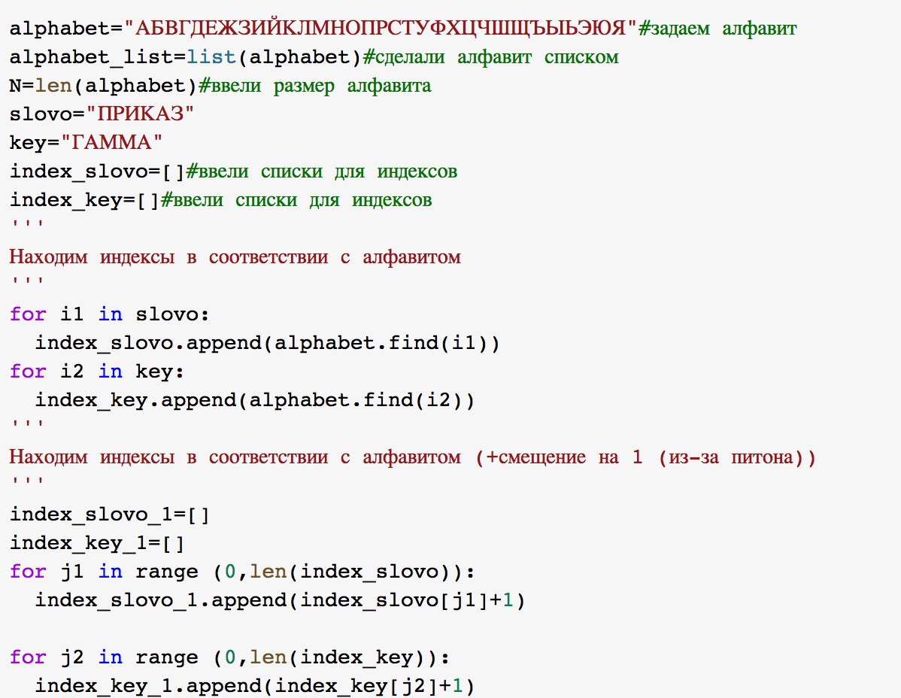
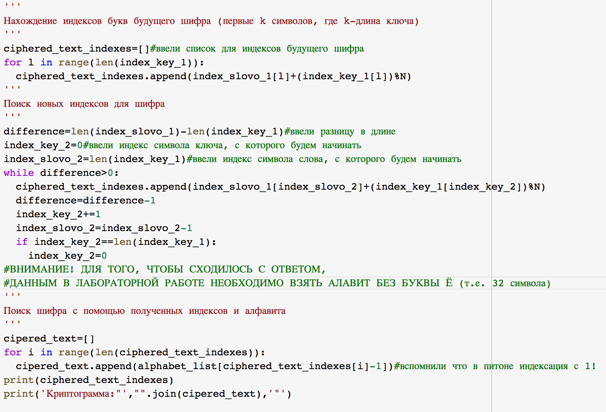
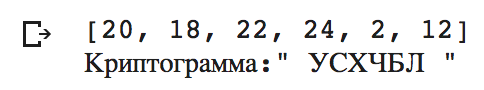

---
## Front matter
lang: ru-RU
title: |
    Лабораторная работа №3  
    Шифрование гаммированием
author: |
    *Дисциплина: Математические основы защиты информации*  
    *и информационной безопасности*  
    \vspace{2pt}
    Студентка: Царитова Нина Аведиковна  
		Группа: НФИмд-02-23  
		\vspace{2pt}

## Formatting
toc: false
slide_level: 2
theme: metropolis
header-includes:
 - \metroset{progressbar=frametitle,sectionpage=progressbar,numbering=fraction}
 - '\makeatletter'
 - '\beamer@ignorenonframefalse'
 - '\makeatother'
aspectratio: 43
section-titles: true
linestretch: 1.25

mainfont: PT Serif
romanfont: PT Serif
sansfont: PT Sans
monofont: PT Mono
mainfontoptions: Ligatures=TeX
romanfontoptions: Ligatures=TeX
sansfontoptions: Ligatures=TeX,Scale=MatchLowercase
monofontoptions: Scale=MatchLowercase,Scale=0.7
---

# Цели и задачи работы

## Цель лабораторной работы

\centering \Large \textbf{Целью} данной лабораторной работы является ознакомление с шифрованием гаммированием, -- а так же реализация шифра на произвольном языке программирования.

## Задание

Реализовать алгоритм шифрования гаммированием конечной гаммой.

# Ход выполнения и результаты

## Реализация

## Гаммирование Реализация

{ #fig:001 width=70% }

## Гаммирование. Реализация

{ #fig:002 width=70% }

## Гаммирование. Результаты

{ #fig:003 width=70% }

## {.standout}

Спасибо за внимание
