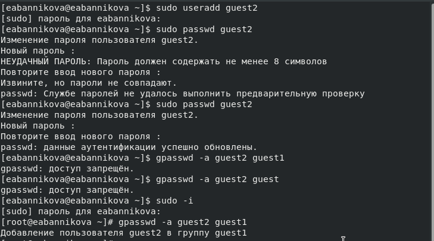

---
## Front matter
lang: ru-RU
title: Лабораторная №3
subtitle: Основы информационной безопасности
author:
  - Банникова Екатерина Алексеевна
institute:
  - Российский университет дружбы народов, Москва, Россия
  - НПМбд-01-19

## i18n babel
babel-lang: russian
babel-otherlangs: english

## Formatting pdf
toc: false
toc-title: Содержание
slide_level: 2
aspectratio: 169
section-titles: true
theme: metropolis
header-includes:
 - \metroset{progressbar=frametitle,sectionpage=progressbar,numbering=fraction}
 - '\makeatletter'
 - '\beamer@ignorenonframefalse'
 - '\makeatother'
---

# Работа с атрибутами файлов для групп пользователей

## Цель лабораторной работы

Получение практических навыков работы в консоли с атрибутами файлов для групп пользователей.

## Задачи лабораторной работы

1. Создать еще одну новую учетную запись
2. Создать группу пользователей
3. От его лица изучить основные команды для работы с атрибутами внутри группы

## Выполнение

Создание новой учетной записи guest2 и установка для нее пароля.
  
{ #fig:1 width=70% }

## Выполнение

Заходим в систему от имени пользователей guest1 и guest2 на разных консолях. Добавляем guest2 в группу к guest1.
Узнаем группы, в которых они состоят.
  
{ #fig:2 width=70% }

## Выполнение
  
Регистрируем пользователя командой newgrp.
  
{ #fig:3 width=80% }

## Выполнение
  
Изменение основных атрибутов с помощью команды chmod и проверка их командой ls -l.
  
{ #fig:4 width=40% }

## Выполнение

Установленные права и разрешенные действия.
  
{ #fig:5 width=45% }

## Выполнение

Минимальные права для совершения операций.
  
{ #fig:6 width=70% }

## Выводы

Получила практические навыки работы в консоли с атрибутами файлов для групп пользователей.

 
  
  

