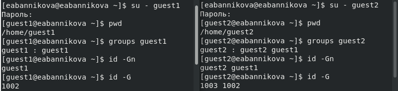
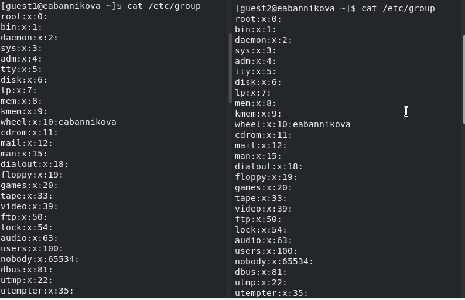
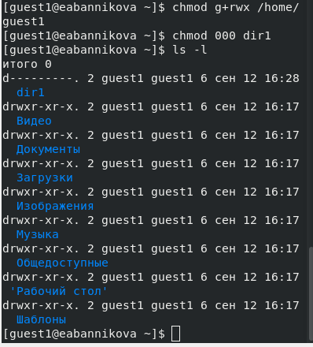
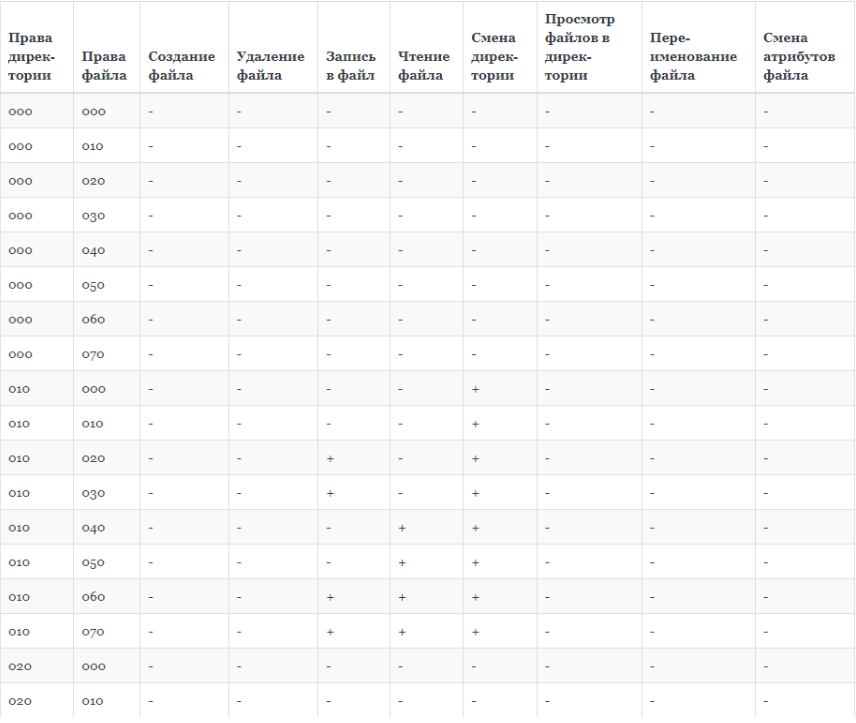

---
## Front matter
title: "Лабораторная работа №3"
subtitle: "Информационная безопасность"
author: "Банникова Екатерина Алексеевна"

## Generic otions
lang: ru-RU
toc-title: "Содержание"

## Bibliography
bibliography: bib/cite.bib
csl: pandoc/csl/gost-r-7-0-5-2008-numeric.csl

## Pdf output format
toc: true # Table of contents
toc-depth: 2
lof: true # List of figures
lot: true # List of tables
fontsize: 12pt
linestretch: 1.5
papersize: a4
documentclass: scrreprt
## I18n polyglossia
polyglossia-lang:
  name: russian
  options:
	- spelling=modern
	- babelshorthands=true
polyglossia-otherlangs:
  name: english
## I18n babel
babel-lang: russian
babel-otherlangs: english
## Fonts
mainfont: PT Serif
romanfont: PT Serif
sansfont: PT Sans
monofont: PT Mono
mainfontoptions: Ligatures=TeX
romanfontoptions: Ligatures=TeX
sansfontoptions: Ligatures=TeX,Scale=MatchLowercase
monofontoptions: Scale=MatchLowercase,Scale=0.9
## Biblatex
biblatex: true
biblio-style: "gost-numeric"
biblatexoptions:
  - parentracker=true
  - backend=biber
  - hyperref=auto
  - language=auto
  - autolang=other*
  - citestyle=gost-numeric
## Pandoc-crossref LaTeX customization
figureTitle: "Рис."
tableTitle: "Таблица"
listingTitle: "Листинг"
lofTitle: "Список иллюстраций"
lotTitle: "Список таблиц"
lolTitle: "Листинги"
## Misc options
indent: true
header-includes:
  - \usepackage{indentfirst}
  - \usepackage{float} # keep figures where there are in the text
  - \floatplacement{figure}{H} # keep figures where there are in the text
---

# Цель работы

Получение практических навыков работы в консоли с атрибутами файлов для групп пользователей.

# Теоретическое введение

Атрибуты - это набор основных девяти битов, определяющих какие из пользователей обладают правами на чтение, запись, исполнение. Первые три бита отвечают права доступа владельца, вторые - для группы пользователей, последние - для всех остальных пользователей в системе.

# Выполнение лабораторной работы

Создаем нового пользователя guest2 командой useradd, затем устанавливаем для него пароль с помощью команды passwd guest1. Добавляем пользователя guest2 в группу.

{ #fig:1 width=70% }

Заходим в систему от имени пользователя guest1 и guest2 на двух терминалах,используя команду su - и только что установленный пароль. Выполняем команду pwd, которая показывает, что мы находимся в домашнем каталоге пользователя guest1 и guest2. Уточняем имя пользователя, его группу, группы, куда входит пользователь. Вводим команду groups, видим, что guest1 состоиттолько в группе guest1, а guest2 в двух: guest1 и guest2. Эту же информацию проверяем через команды id -Gn.

{ #fig:2 width=70% }

Посмотрим файл /etc/password командой cat /etc/password. Находим информацию о пользователе, что соотвествует данным, полученным с помощью команды id и groups.

{ #fig:3 width=70% }

От имени пользователя guest2 выполняем регистрацию пользователя в группе командой newgrp

{ #fig:4 width=70% }

От имени пользователч guest1 изменяем права на директорию /home/guest1, чтобы пользователи в группе получили доступ к файлам в домашнем каталоге. Затем меняем в директории dir1 атрибуты с помощью команды chmod 000 dir1. Проверяем изменения командой li -l.

{ #fig:5 width=70% }

Меняя атрибуты у директории dir1 и файла file1 от имени пользователя guest и делая проверку от пользователя guest2, заполняем таблицу.

{ #fig:7 width=70% }

{ #fig:8 width=70% }

{ #fig:9 width=70% }

На основании заполненной таблицы определяем те или иные минимально необходимые права для выполнения пользователем guest2 операций внутри директории dir1 и заполняем таблицу.

{ #fig:10 width=70% }

# Выводы

Получила практические навыки работы в консоли с атрибутами файлов для групп пользователей.

# Список литературы{.unnumbered}

::: {#refs}
:::
