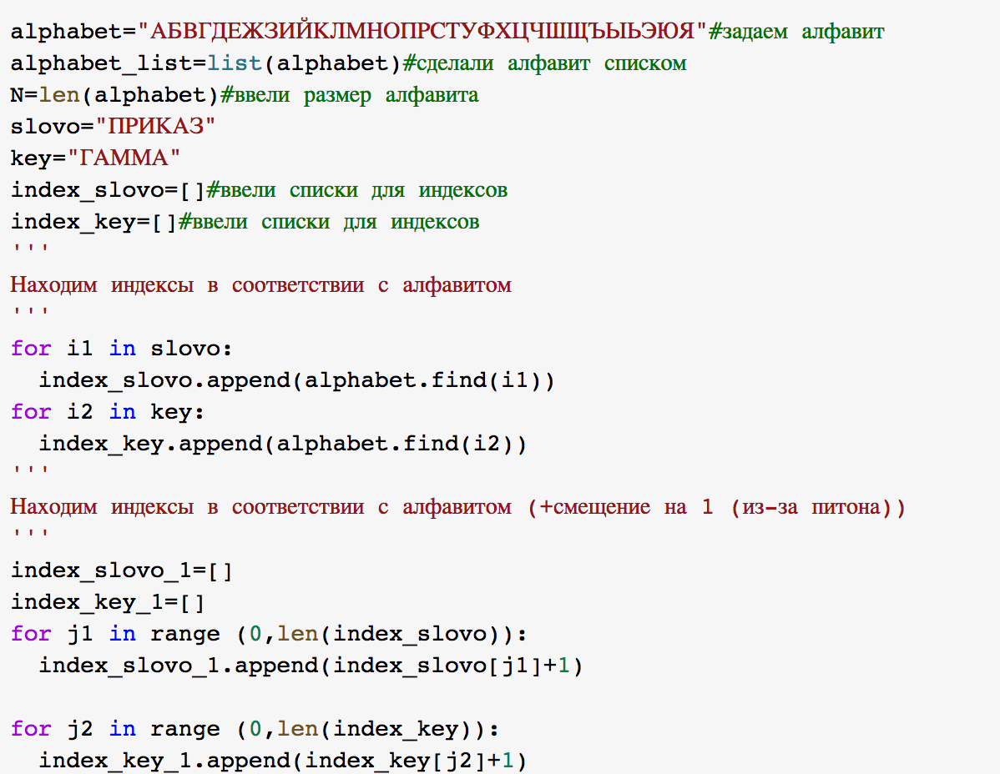
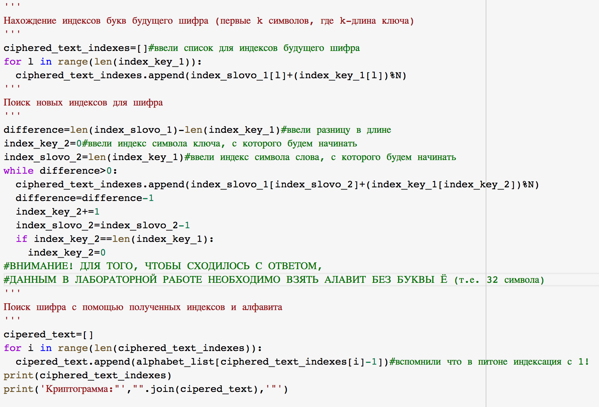
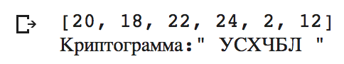

---
# Титульный лист
title: |
    Лабораторная работа №3  
    Шифрование гаммированием
author:
- "Царитова Нина Аведиковна"
- "Группа: НФИмд-02-23"

# Общие опции
lang: ru-RU
toc-title: "Содержание"

# Библиография
bibliography: bib/cite.bib
csl: pandoc/csl/gost-r-7-0-5-2008-numeric.csl

# Конвертация в ПДФ
toc: true # Содержание
toc_depth: 2
lof: true # Список изображений
lot: true # Список таблиц
fontsize: 12pt
linestretch: 1.5
papersize: a4
documentclass: scrreprt

## I18n
polyglossia-lang:
  name: russian
  options:
	- spelling=modern
	- babelshorthands=true
polyglossia-otherlangs:
  name: english
### Шрифты
mainfont: PT Serif
romanfont: PT Serif
sansfont: PT Sans
monofont: PT Mono
mainfontoptions: Ligatures=TeX
romanfontoptions: Ligatures=TeX
sansfontoptions: Ligatures=TeX,Scale=MatchLowercase
monofontoptions: Scale=MatchLowercase,Scale=0.8
## Biblatex
biblatex: true
biblio-style: "gost-numeric"
biblatexoptions:
  - parentracker=true
  - backend=biber
  - hyperref=auto
  - language=auto
  - autolang=other*
  - citestyle=gost-numeric

## Misc options
indent: true
header-includes:
  - \linepenalty=10 # the penalty added to the badness of each line within a paragraph (no associated penalty node) Increasing the value makes tex try to have fewer lines in the paragraph.
  - \interlinepenalty=0 # value of the penalty (node) added after each line of a paragraph.
  - \hyphenpenalty=50 # the penalty for line breaking at an automatically inserted hyphen
  - \exhyphenpenalty=50 # the penalty for line breaking at an explicit hyphen
  - \binoppenalty=700 # the penalty for breaking a line at a binary operator
  - \relpenalty=500 # the penalty for breaking a line at a relation
  - \clubpenalty=150 # extra penalty for breaking after first line of a paragraph
  - \widowpenalty=150 # extra penalty for breaking before last line of a paragraph
  - \displaywidowpenalty=50 # extra penalty for breaking before last line before a display math
  - \brokenpenalty=100 # extra penalty for page breaking after a hyphenated line
  - \predisplaypenalty=10000 # penalty for breaking before a display
  - \postdisplaypenalty=0 # penalty for breaking after a display
  - \floatingpenalty = 20000 # penalty for splitting an insertion (can only be split footnote in standard LaTeX)
  - \raggedbottom # or \flushbottom
  - \usepackage{float} # keep figures where there are in the text
  - \floatplacement{figure}{H} # keep figures where there are in the text

  - \usepackage{titling}
  - \setlength{\droptitle}{-9em}
  - \pretitle{\begin{center}
      \textbf{РОССИЙСКИЙ УНИВЕРСИТЕТ ДРУЖБЫ НАРОДОВ}\\
      \textbf{Факультет физико-математических и естественных наук}\\
      \textbf{Кафедра прикладной информатики и теории вероятностей}
      \vspace{9cm}
      \LARGE\\}
  - \posttitle{\vskip 1em \Large \emph{\textit{Дисциплина$:$ Математические основы защиты информации и информационной безопасности}} \end{center}}
  - \preauthor{\vskip 3em \begin{flushright} \large \begin{tabular}[t]{c}}
  - \postauthor{\end{tabular}\par\end{flushright} \vfill \vskip 5em}
---

# Цель работы

Целью данной лабораторной работы является ознакомление с шифрованием гаммированием, -- а так же реализация шифрования гаммирования конечной гаммой.

# Задание

Реализовать алгоритм шифрования гаммированием конечной гаммой.

# Теоретическое введение

Гаммирование, или Шифр XOR — метод симметричного шифрования, заключающийся в «наложении» последовательности, состоящей из случайных чисел, на открытый текст. Последовательность случайных чисел называется гамма-последовательностью и используется для зашифровывания и расшифровывания данных. Суммирование обычно выполняется в каком-либо конечном поле. Например, в поле Галуа суммирование принимает вид операции «исключающее ИЛИ (XOR)»[@wiki:xor].

В криптографии простой шифр XOR является разновидностью аддитивного шифра, алгоритма шифрования, который работает в соответствии с принципами [@wiki:xorEN]:

{ #fig:001 width=100% }

где $\oplus$ обозначает операцию исключающей дизъюнкции (XOR). Эта операция иногда называется сложением по модулю 2 (или вычитанием, что идентично). С помощью данной логики строка текста может быть зашифрована путем применения побитового оператора XOR к каждому символу с использованием заданного ключа. Для расшифровки результата достаточно повторно применить функцию XOR с ключом, чтобы снять шифр [@wiki:xorEN].

Шифры гаммирования являются самыми эффективными с точки зрения стойкости и скорости преобразований (процедур зашифрования и дешифрования). По стойкости данные шифры относятся к классу совершенных. Для зашифрования и дешифрования используются элементарные арифметические операции – открытое/зашифрованное сообщение и гамма, представленные в числовом виде, складываются друг с другом по модулю (mod)[@anisimov:xor].

Пусть символам исходного алфавита соответствуют числа от 0 (А) до 32 (Я). Если обозначить число, соответствующее исходному символу, x, а символу ключа – k, то можно записать правило гаммирования следующим образом: $z = x + k (mod N),$ где $z$ – закодированный символ, $N$ - количество символов в алфавите, а сложение по модулю $N$ - операция, аналогичная обычному сложению, с тем отличием, что если обычное суммирование дает результат, больший или равный $N$, то значением суммы считается остаток от деления его на $N$ [@elec:xor].

# Выполнение лабораторной работы

## Шифрование гаммированием

В соответствии с заданием, была написана программа для шифрования гаммированием. Программный код представлен ниже.

{ #fig:002 width=100% }

{ #fig:003 width=100% }

Результаты выполнения программы представлены ниже.

{ #fig:004 width=100% }

# Выводы

Таким образом, была достигнута цель, поставленная в начале лабораторной работы: я ознакомилась с шифрованием гаммированием, а так же мне удалось реализовать алгоритм шифрования конечной гаммой на языке программирования Python.

# Список литературы{.unnumbered}

::: {#refs}
:::
