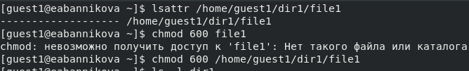
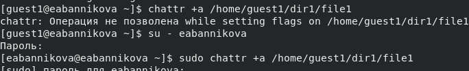
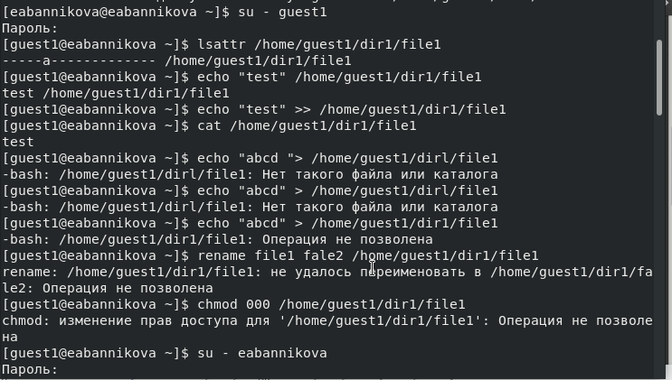
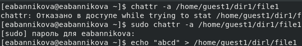
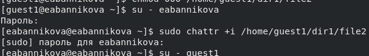

---
## Front matter
lang: ru-RU
title: Лабораторная №4
subtitle: Основы информационной безопасности
author:
  - Банникова Екатерина Алексеевна
institute:
  - Российский университет дружбы народов, Москва, Россия
  - НПМбд-01-19

## i18n babel
babel-lang: russian
babel-otherlangs: english

## Formatting pdf
toc: false
toc-title: Содержание
slide_level: 2
aspectratio: 169
section-titles: true
theme: metropolis
header-includes:
 - \metroset{progressbar=frametitle,sectionpage=progressbar,numbering=fraction}
 - '\makeatletter'
 - '\beamer@ignorenonframefalse'
 - '\makeatother'
---

# Дискреционное разграничение прав в Linux. Расширенные атрибуты

## Цель лабораторной работы

Получение навыков работы с расширенными атрибутами через консоль

## Задачи лабораторной работы

1. Посмотреть расширенные атрибуты файлов
2. Изменить расширенные атрибуты a и i файлов через администратора
3. Совершить ряд действий над файлом и изучить результат

## Выполнение

От имени пользователя guest1 просмотрим расширенные атрибуты. При попытке добавить расширенный атрибут получаем сообщение об ошибке.
  
{ #fig:1 width=60% }

{ #fig:2 width=60% }

## Выполнение

От имени администратора добавляем расширенный аттрибут a. 
  
{ #fig:3 width=80% }

## Выполнение
  
Дозаписываем в конец файла новую информацию и проверяем. Пытаемся стереть информацию в файле, на что получаем ошибку. Также не удаётся переименовать файл и изменить его атрибуты.
  
{ #fig:4 width=50% }

## Выполнение
  
Снимаем расширенный атрибут a командой chattr -a от лица администратора. При повторе ранее описанных действий теперь не произошло ошибок и они все выполнились 
  
{ #fig:5 width=70% }

## Выполнение

От имени адмистратора добавим файлу расширенный атрибут i и повторим ранее описанные действия. В этом случае файл можно только читать, но нельзя никак изменить. 
  
{ #fig:6 width=60% }

{ #fig:7 width=60% }

## Выводы

Приобрела практические навыки работы с расширенными атрибутами файлов через консоль, опробовала на практике действия с файлами с установленными на них расширенными атрибутами a и i.

 
  
  

