---
# Титульный лист
title: |
    Лабораторная работа №4.  
    Вычисление наибольшего общего делителя
author:
- "Студентка: Царитова Нина Аведиковна"
- "Группа: НФИмд-02-23"

# Общие опции
lang: ru-RU
toc-title: "Содержание"

# Библиография
bibliography: bib/cite.bib
csl: pandoc/csl/gost-r-7-0-5-2008-numeric.csl

# Конвертация в ПДФ
toc: true # Содержание
toc_depth: 2
lof: true # Список изображений
lot: true # Список таблиц
fontsize: 12pt
linestretch: 1.5
papersize: a4
documentclass: scrreprt

## I18n
polyglossia-lang:
  name: russian
  options:
	- spelling=modern
	- babelshorthands=true
polyglossia-otherlangs:
  name: english
### Шрифты
mainfont: PT Serif
romanfont: PT Serif
sansfont: PT Sans
monofont: PT Mono
mainfontoptions: Ligatures=TeX
romanfontoptions: Ligatures=TeX
sansfontoptions: Ligatures=TeX,Scale=MatchLowercase
monofontoptions: Scale=MatchLowercase,Scale=0.8
## Biblatex
biblatex: true
biblio-style: "gost-numeric"
biblatexoptions:
  - parentracker=true
  - backend=biber
  - hyperref=auto
  - language=auto
  - autolang=other*
  - citestyle=gost-numeric

## Misc options
indent: true
header-includes:
  - \linepenalty=10 # the penalty added to the badness of each line within a paragraph (no associated penalty node) Increasing the value makes tex try to have fewer lines in the paragraph.
  - \interlinepenalty=0 # value of the penalty (node) added after each line of a paragraph.
  - \hyphenpenalty=50 # the penalty for line breaking at an automatically inserted hyphen
  - \exhyphenpenalty=50 # the penalty for line breaking at an explicit hyphen
  - \binoppenalty=700 # the penalty for breaking a line at a binary operator
  - \relpenalty=500 # the penalty for breaking a line at a relation
  - \clubpenalty=150 # extra penalty for breaking after first line of a paragraph
  - \widowpenalty=150 # extra penalty for breaking before last line of a paragraph
  - \displaywidowpenalty=50 # extra penalty for breaking before last line before a display math
  - \brokenpenalty=100 # extra penalty for page breaking after a hyphenated line
  - \predisplaypenalty=10000 # penalty for breaking before a display
  - \postdisplaypenalty=0 # penalty for breaking after a display
  - \floatingpenalty = 20000 # penalty for splitting an insertion (can only be split footnote in standard LaTeX)
  - \raggedbottom # or \flushbottom
  - \usepackage{float} # keep figures where there are in the text
  - \floatplacement{figure}{H} # keep figures where there are in the text

  - \usepackage{titling}
  - \setlength{\droptitle}{-9em}
  - \pretitle{\begin{center}
      \textbf{РОССИЙСКИЙ УНИВЕРСИТЕТ ДРУЖБЫ НАРОДОВ}\\
      \textbf{Факультет физико-математических и естественных наук}\\
      \textbf{Кафедра прикладной информатики и теории вероятностей}
      \vspace{9cm}
      \LARGE\\}
  - \posttitle{\vskip 1em \Large \emph{\textit{Дисциплина$:$ Математические основы защиты информации и информационной безопасности}} \end{center}}
  - \preauthor{\vskip 3em \begin{flushright} \large \begin{tabular}[t]{c}}
  - \postauthor{\end{tabular}\par\end{flushright} \vfill \vskip 5em}
---

# Цель работы

Целью данной лабораторной работы является ознакомление с алгоритмами вычисления наибольшего общего делителя, -- а так же реализация алгоритмов на произвольном языке программирования.

# Теоретическое введение

Рассмотрим, что такое наибольший общий делитель. Вспомним, что делитель – это число, на которое другое число делится без остатка. Наибольшим общим делителем (НОД) для двух целых чисел m и n называется наибольший из их общих делителей. Пример: для чисел 54 и 24 наибольший общий делитель равен 6. 

Алгоритм Евклида — один из наиболее ранних численных алгоритмов в истории. Название было дано в честь греческого математика Евклида, который впервые дал ему описание в книгах «Начала». Изначально назывался «взаимным вычитанием», так как его принцип заключался в последовательном вычитании из большего числа меньшего, пока в результате не получится ноль. Сегодня чаще используется взятие остатка от деления вместо вычитания, но суть метода сохранилась.

Алгоритм представлен в следующей блок-схеме:

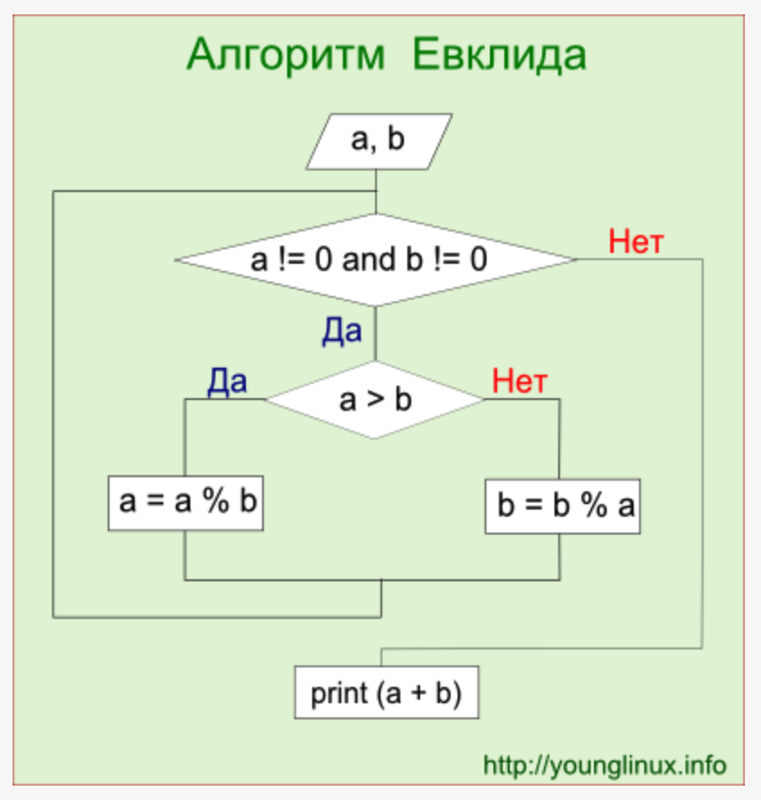{ #fig:001 width=70% }

Бинарный алгоритм Евклида — метод нахождения наибольшего общего делителя двух целых чисел. Данный алгоритм "быстрее" обычного алгоритма Евклида, т.к. вместо медленных операций деления и умножения используются сдвиги. Возможно, алгоритм был известен еще в Китае 1-го века, но опубликован был лишь в 1967 году израильским физиком и программистом Джозефом Стайном.

# Выполнение лабораторной работы

Нами были рассмотрены следующие алгоритмы:
1. Алгоритм Евклида;
2. Бинарный алгоритм Евклида;
3. Расширенный алгоритм Евклида;
4. Расширенный бинарный алгоритм Евклида.

Программный код и результаты выполнения программ представлен ниже.

## Алгоритм Евклида

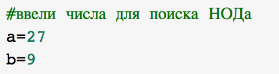{ #fig:002 width=70% }

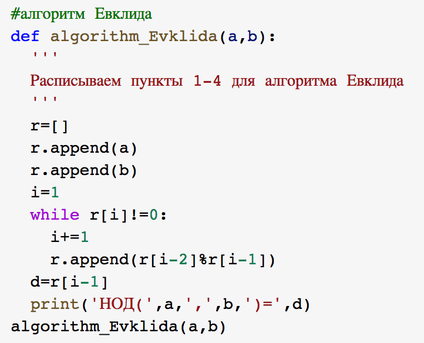{ #fig:003 width=70% }

Результаты выполнения программы представлены ниже (см. рис. [-@fig:004]).

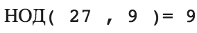{ #fig:004 width=70% }

## Бинарный алгоритм Евклида. 1 способ

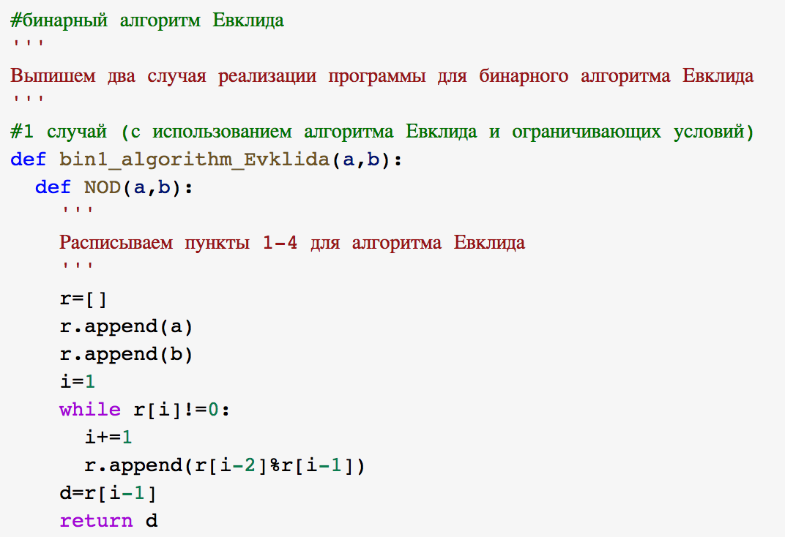{ #fig:005 width=70% }

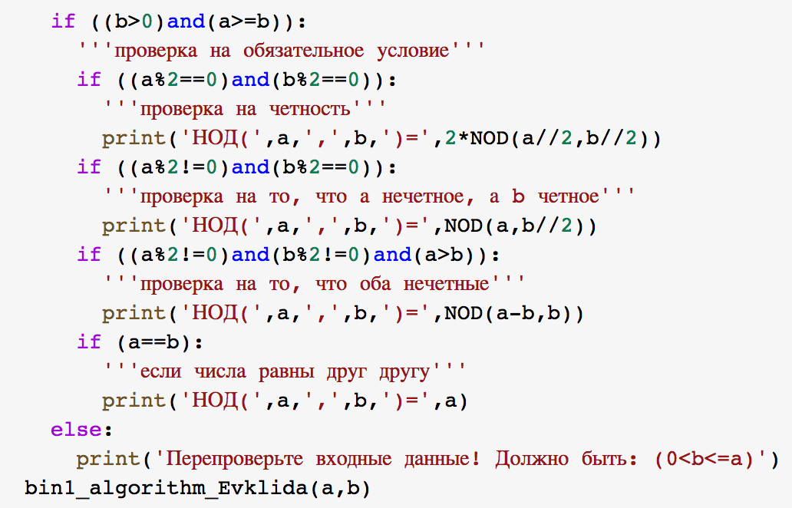{ #fig:006 width=70% }

Результаты выполнения программы представлены ниже (см. рис. [-@fig:007]).

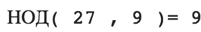{ #fig:007 width=70% }

## Бинарный алгоритм Евклида. 2 способ

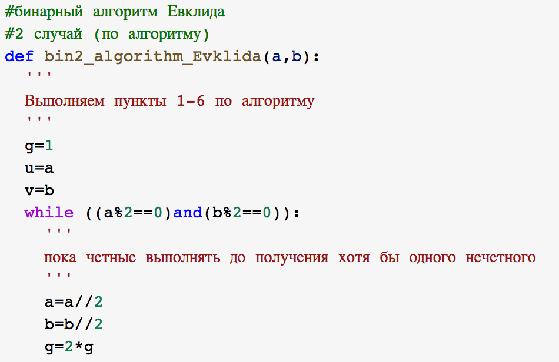{ #fig:008 width=70% }

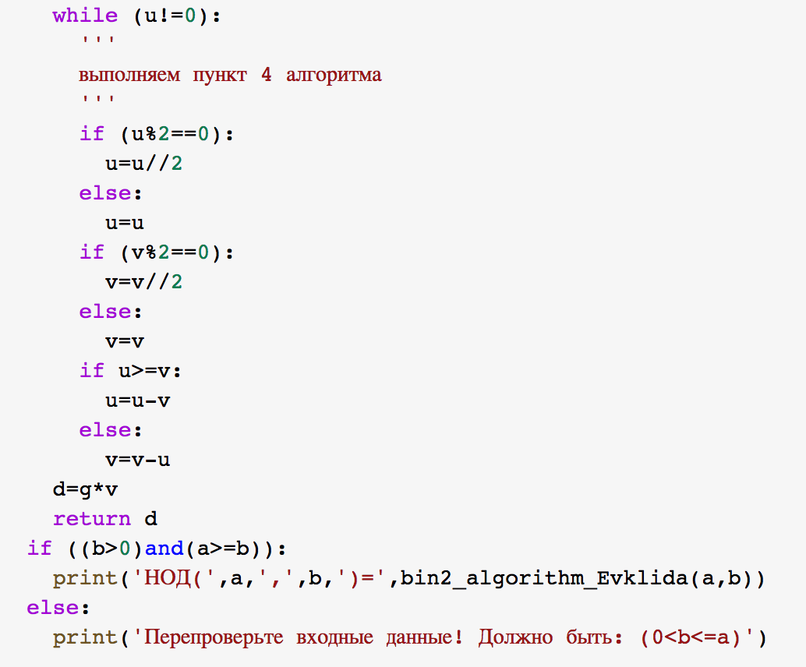{ #fig:009 width=70% }

Результаты выполнения программы представлены ниже (см. рис. [-@fig:010]).

{ #fig:010 width=70% }

## Расширенный алгоритм Евклида

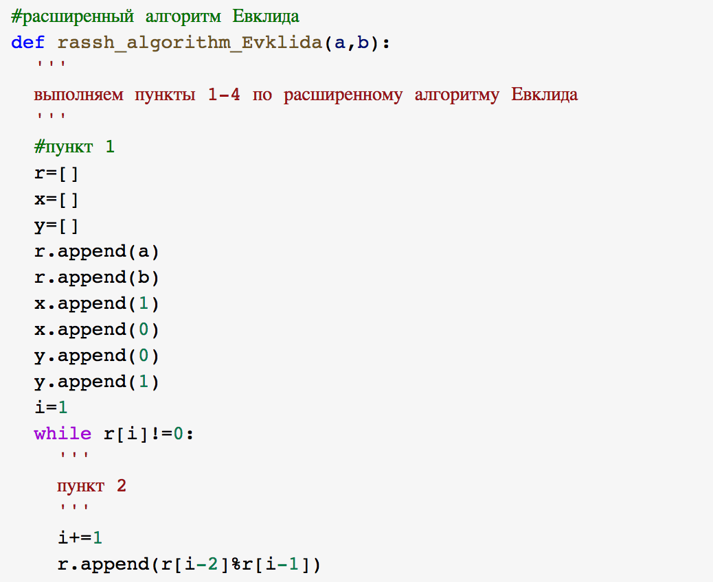{ #fig:011 width=70% }

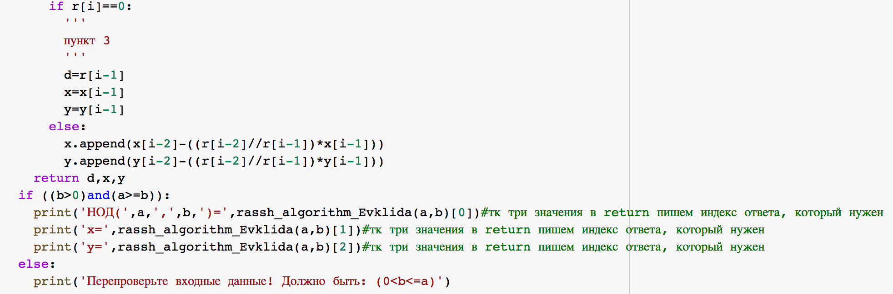{ #fig:012 width=70% }

Результаты выполнения программы представлены ниже (см. рис. [-@fig:013]).

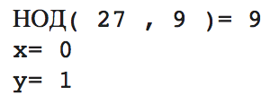{ #fig:013 width=70% }

## Расширенный бинарный алгоритм Евклида

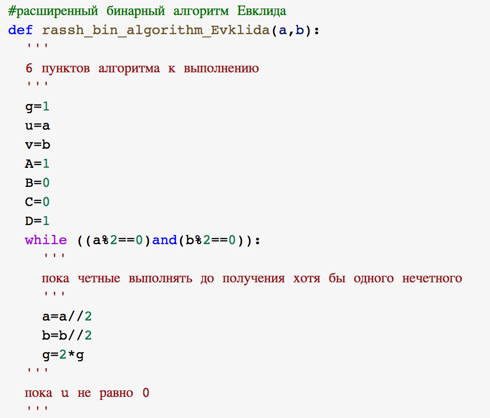{ #fig:014 width=60% }

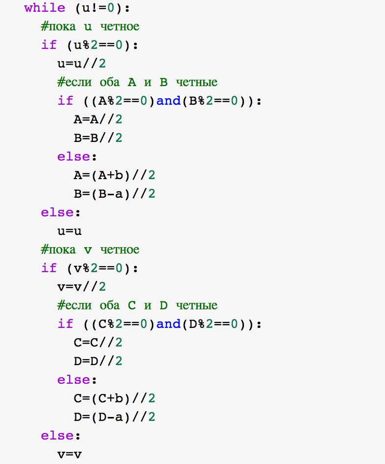{ #fig:015 width=60% }

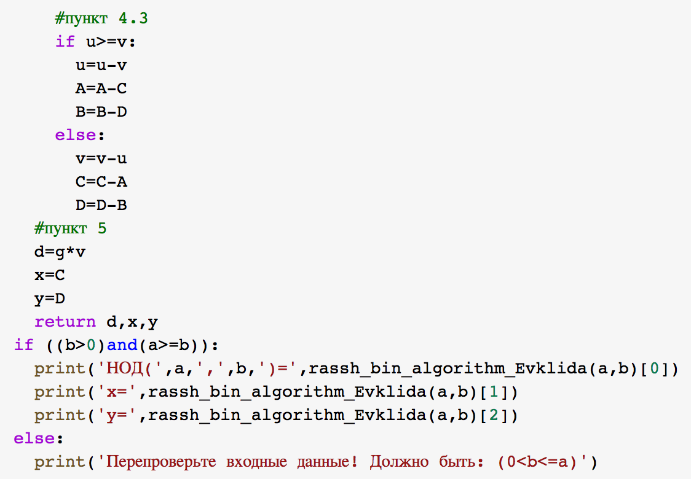{ #fig:016 width=60% }

Результаты выполнения программы представлены ниже (см. рис. [-@fig:017]).

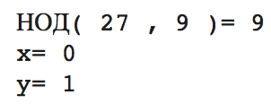{ #fig:017 width=70% }

# Выводы

Таким образом, я ознакомилась с алгоритмами вычисления наибольшего общего делителя, -- а так же реализовала данные алгоритмы на языке программирования Python 3.

# Список литературы{.unnumbered}

::: 1. https://ru.wikipedia.org/wiki/Алгоритм_Евклида
    2. https://ru.wikipedia.org/wiki/Расширенный_алгоритм_Евклида
:::
