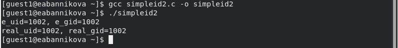
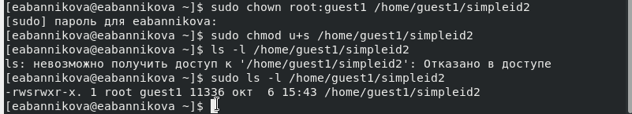
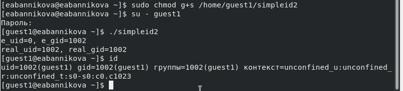

---
## Front matter
lang: ru-RU
title: Лабораторная №5
subtitle: Основы информационной безопасности
author:
  - Банникова Екатерина Алексеевна
institute:
  - Российский университет дружбы народов, Москва, Россия
  - НПМбд-01-19

## i18n babel
babel-lang: russian
babel-otherlangs: english

## Formatting pdf
toc: false
toc-title: Содержание
slide_level: 2
aspectratio: 169
section-titles: true
theme: metropolis
header-includes:
 - \metroset{progressbar=frametitle,sectionpage=progressbar,numbering=fraction}
 - '\makeatletter'
 - '\beamer@ignorenonframefalse'
 - '\makeatother'
---

# Дискреционное разграничение прав в Linux. Исследование влияния дополнительных атрибутов

## Цель лабораторной работы

* Изучить особенности работы с дополнительными атрибутами SetUID, SetGID и Sticky
* Изучить механизмы изменения индефикатора.

## Задачи лабораторной работы

1. Создать программу, выводящую uid и gid, и посмотреть на вывод после добавления SetUID и SetGID битов.
2. Создать программу для чтения файлов и проверить вывод после добавления SetUID бита.
3. На примере папки /tmp изучить влияние Sticky бита на запись и удаление файлов.

## Выполнение

Создаём файл simpleid2.c, который будет выводить uid и gid. При отсутствии дополнительных битов, она выводит информацию, совпадающую с выводом команды id.
  
{ #fig:1 width=75% }

## Выполнение

С помощью команды chown меняем владельца файла на root и устанавливаем SetUID командой chmod u+s.
  
{ #fig:2 width=75% }

## Выполнение
  
После запуска видим, что uid сменилось на 0 (для root), в то время как в команде id uid всё ещё остался 1002

{ #fig:3 width=75% }

## Выполнение
  
С помощью команды chown меняем группу для файла и устанавливаем SetGID командой chmod g+s. Видим, что при запуске программы изменился вывод gid. 
  
{ #fig:4 width=75% }

## Выполнение

Проводим над файлом file01.txt следующие действия: читаем его, дозаписываем и перезаписываем информацию, переименовываем. Эти действия проходят без ошибок. При попытке удаления возникает ошибка. 

{ #fig:5 width=70% }

## Выполнение

От имени суперпользователя удаляем sticky-бит командой chmod -t. 

{ #fig:6 width=70% }

## Выполнение

Повторяем описанные ранее действия над файлом file01.txt. Теперь пользователь может удалить не принадлежащий ему файл. 

{ #fig:7 width=70% }

## Выводы

* Я изучила механизмы изменения идентификаторов. 
* Получила практические навыки по работе с дополнительными атрибутами.

 
  
  

