---
## Front matter
lang: ru-RU
title: |
    Лабораторная работа №5.  
    Вероятностные алгоритмы проверки чисел на простоту
author: |
    *Дисциплина: Математические основы защиты информации*  
    *и информационной безопасности*  
    \vspace{2pt}
    Студентка: Царитова Нина Аведиковна  
		Группа: НФИмд-02-23  
		Преподаватель: д-р.ф.-м.н., проф. Кулябов Дмитрий Сергеевич
    \vspace{2pt}

## Formatting
toc: false
slide_level: 2
theme: metropolis
header-includes:
 - \metroset{progressbar=frametitle,sectionpage=progressbar,numbering=fraction}
 - '\makeatletter'
 - '\beamer@ignorenonframefalse'
 - '\makeatother'
aspectratio: 43
section-titles: true
linestretch: 1.25

mainfont: PT Serif
romanfont: PT Serif
sansfont: PT Sans
monofont: PT Mono
mainfontoptions: Ligatures=TeX
romanfontoptions: Ligatures=TeX
sansfontoptions: Ligatures=TeX,Scale=MatchLowercase
monofontoptions: Scale=MatchLowercase,Scale=0.7
---

# Цели и задачи работы

## Цель лабораторной работы

\centering \Large \textbf{Целью} данной лабораторной работы является ознакомление с вероятностными алгоритмами проверки чисел на простоту.

## Задание

Реализовать все рассмотренные в инструкции к лабораторной работе алгоритмы проверки чисел на простоту программно.

# Ход выполнения и результаты

## Входные данные

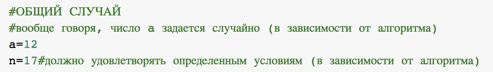{ #fig:001 width=70% }

## Алгоритм, реализующий тест Ферма. Реализация

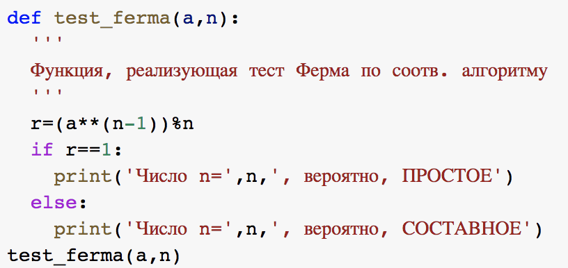{ #fig:002 width=70% }

## Алгоритм, реализующий тест Ферма. Результаты

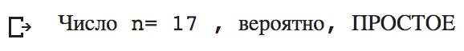{ #fig:003 width=70% }

## Алгоритм вычисления символа Якоби. Реализация

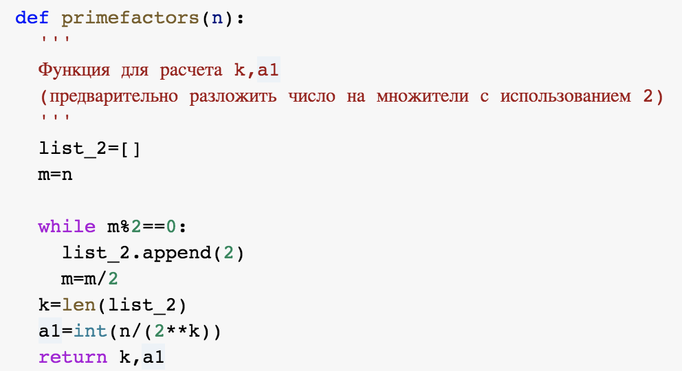{ #fig:004 width=70% }

## Алгоритм вычисления символа Якоби. Реализация

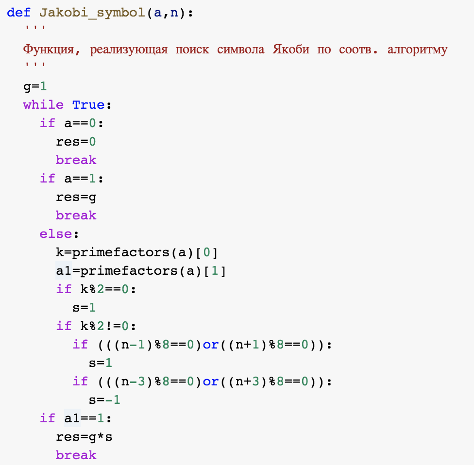{ #fig:005 width=70% }

## Алгоритм вычисления символа Якоби. Реализация

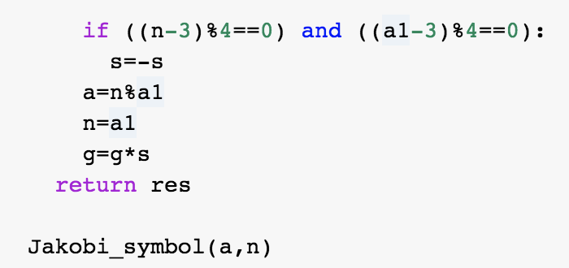{ #fig:006 width=70% }

## Алгоритм вычисления символа Якоби. Результат

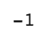{ #fig:007 width=70% }

## Алгоритм, реализующий тест Соловэя-Штрассена. Реализация

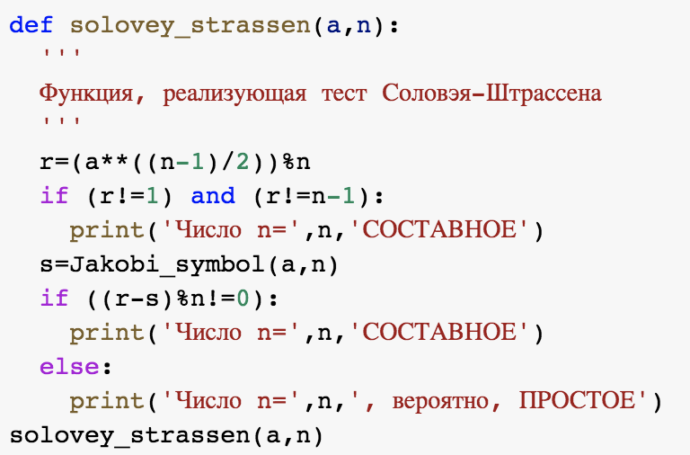{ #fig:008 width=70% }

## Алгоритм, реализующий тест Соловэя-Штрассена. Результат

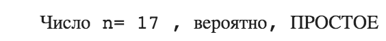{ #fig:009 width=70% }

## Алгоритм, реализующий тест Миллера-Рабина. Реализация

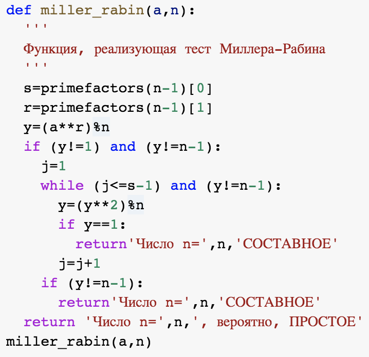{ #fig:010 width=70% }

## Алгоритм, реализующий тест Миллера-Рабина. Результат

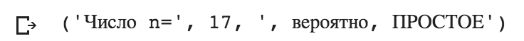{ #fig:011 width=70% }

## Вывод

В результате выполнения данной лабораторной работы нам удалось осуществить программно алгоритмы, рассмотренные в описании к лабораторной работе.

