---
# Титульный лист
title: |
    Лабораторная работа №5.  
    Вероятностные алгоритмы проверки чисел на простоту
author:
- "Студентка: Царитова Нина Аведиковна"
- "Группа: НФИмд-02-23"
- "Преподаватель: Кулябов Дмитрий Сергеевич,"
- "д-р.ф.-м.н., проф."

# Общие опции
lang: ru-RU
toc-title: "Содержание"

# Библиография
bibliography: bib/cite.bib
csl: pandoc/csl/gost-r-7-0-5-2008-numeric.csl

# Конвертация в ПДФ
toc: true # Содержание
toc_depth: 2
lof: true # Список изображений
lot: true # Список таблиц
fontsize: 12pt
linestretch: 1.5
papersize: a4
documentclass: scrreprt

## I18n
polyglossia-lang:
  name: russian
  options:
	- spelling=modern
	- babelshorthands=true
polyglossia-otherlangs:
  name: english
### Шрифты
mainfont: PT Serif
romanfont: PT Serif
sansfont: PT Sans
monofont: PT Mono
mainfontoptions: Ligatures=TeX
romanfontoptions: Ligatures=TeX
sansfontoptions: Ligatures=TeX,Scale=MatchLowercase
monofontoptions: Scale=MatchLowercase,Scale=0.8
## Biblatex
biblatex: true
biblio-style: "gost-numeric"
biblatexoptions:
  - parentracker=true
  - backend=biber
  - hyperref=auto
  - language=auto
  - autolang=other*
  - citestyle=gost-numeric

## Misc options
indent: true
header-includes:
  - \linepenalty=10 # the penalty added to the badness of each line within a paragraph (no associated penalty node) Increasing the value makes tex try to have fewer lines in the paragraph.
  - \interlinepenalty=0 # value of the penalty (node) added after each line of a paragraph.
  - \hyphenpenalty=50 # the penalty for line breaking at an automatically inserted hyphen
  - \exhyphenpenalty=50 # the penalty for line breaking at an explicit hyphen
  - \binoppenalty=700 # the penalty for breaking a line at a binary operator
  - \relpenalty=500 # the penalty for breaking a line at a relation
  - \clubpenalty=150 # extra penalty for breaking after first line of a paragraph
  - \widowpenalty=150 # extra penalty for breaking before last line of a paragraph
  - \displaywidowpenalty=50 # extra penalty for breaking before last line before a display math
  - \brokenpenalty=100 # extra penalty for page breaking after a hyphenated line
  - \predisplaypenalty=10000 # penalty for breaking before a display
  - \postdisplaypenalty=0 # penalty for breaking after a display
  - \floatingpenalty = 20000 # penalty for splitting an insertion (can only be split footnote in standard LaTeX)
  - \raggedbottom # or \flushbottom
  - \usepackage{float} # keep figures where there are in the text
  - \floatplacement{figure}{H} # keep figures where there are in the text

  - \usepackage{titling}
  - \setlength{\droptitle}{-9em}
  - \pretitle{\begin{center}
      \textbf{РОССИЙСКИЙ УНИВЕРСИТЕТ ДРУЖБЫ НАРОДОВ}\\
      \textbf{Факультет физико-математических и естественных наук}\\
      \textbf{Кафедра прикладной информатики и теории вероятностей}
      \vspace{9cm}
      \LARGE\\}
  - \posttitle{\vskip 1em \Large \emph{\textit{Дисциплина$:$ Математические основы защиты информации и информационной безопасности}} \end{center}}
  - \preauthor{\vskip 3em \begin{flushright} \large \begin{tabular}[t]{c}}
  - \postauthor{\end{tabular}\par\end{flushright} \vfill \vskip 5em}
---

# Цель работы

Целью данной лабораторной работы является ознакомление с вероятностными алгоритмами проверки чисел на простоту и программная реализация данных алгоритмов.

# Теоретическое введение

## Тест Ферма

Тест простоты Ферма в теории чисел — это тест простоты натурального числа n, основанный на малой теореме Ферма.

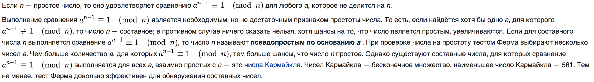{ #fig:001 width=70% }

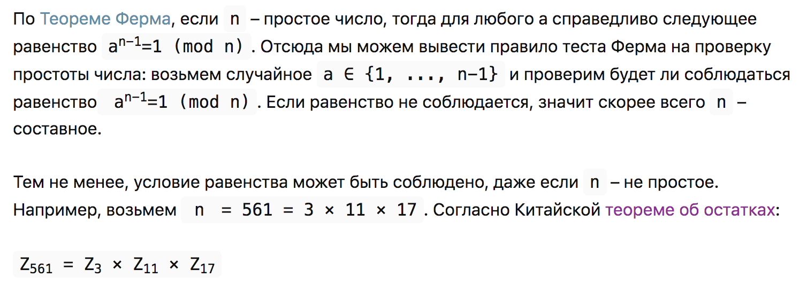{ #fig:002 width=70% }

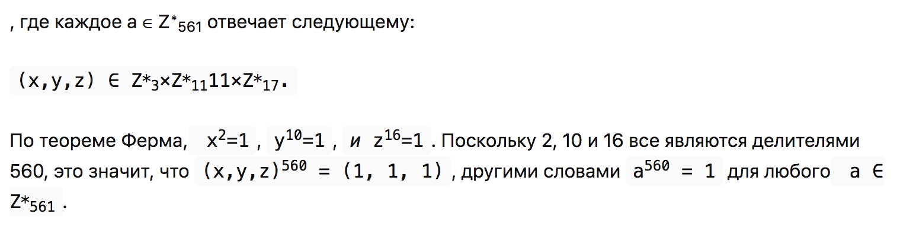{ #fig:003 width=70% }

Не имеет значения какое a мы выберем, 561 всегда будет проходить тест Ферма несмотря на то, что оно составное, до тех пор, пока a является взаимно простым с n. Такие числа называются числами Кармайкла и оказывается, что их существует бесконечное множество.

Если a не взаимно простое с n, то оно тест Ферма не проходит, но в этом случае мы можем отказаться от тестов и продолжить искать делители n, вычисляя НОД(a,n).

## Символ Якоби

Символ Якоби — теоретико-числовая функция двух аргументов, введённая К. Якоби в 1837 году. Является квадратичным характером в кольце вычетов.

Символ Якоби обобщает символ Лежандра на все нечётные числа, большие единицы. Символ Кронекера — Якоби, в свою очередь, обобщает символ Якоби на все целые числа, но в практических задачах символ Якоби играет гораздо более важную роль, чем символ Кронекера — Якоби.

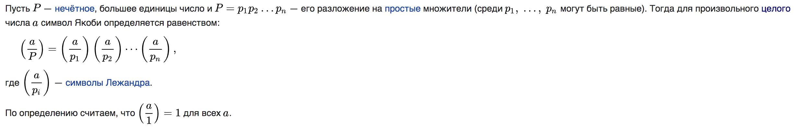{ #fig:004 width=60% }

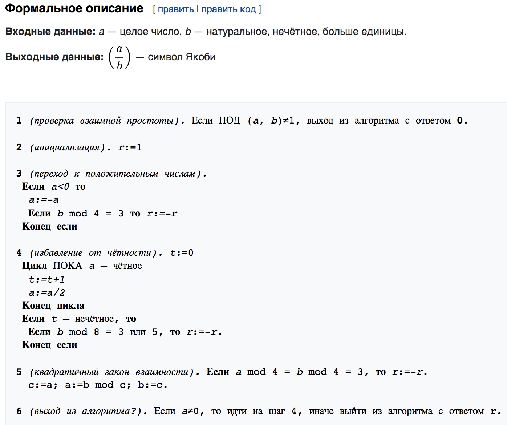{ #fig:005 width=60% }

## Тест Соловэя-Штрассена

Роберт Соловей и Фолькер Штрассен разработали алгоритм вероятностного тестирования простоты числа, который использует символ Якоби. Определяет числа как составные или вероятно простые. Распознает числа Кармайкла как составные.
Итак, для начала необходимо ввести нужные понятия.

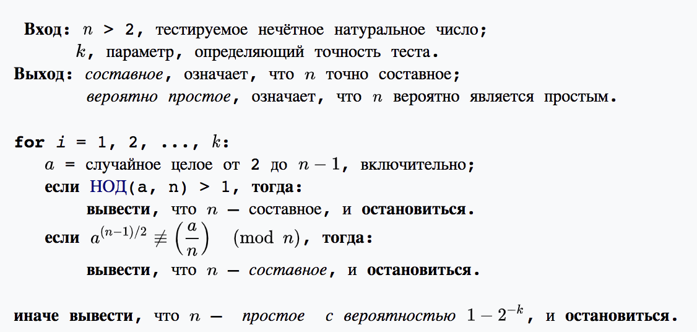{ #fig:006 width=60% }

Вероятностные тесты применяются в системах основанных на проблеме факторизации, например RSA или схема Рабина. Однако на практике степень достоверности теста Соловея — Штрассена не является достаточной, вместо него используется тест Миллера — Рабина. Более того, используются объединенные алгоритмы, например пробное деление и тест Миллера — Рабина, при правильном выборе параметров можно получить результаты лучше, чем при применении каждого теста по отдельности.

## Тест Миллера-Рабина

Тест Миллера — Рабина — вероятностный полиномиальный тест простоты. Тест Миллера — Рабина, наряду с тестом Ферма и тестом Соловея — Штрассена, позволяет эффективно определить, является ли данное число составным. Однако, с его помощью нельзя строго доказать простоту числа. Тем не менее тест Миллера — Рабина часто используется в криптографии для получения больших случайных простых чисел.

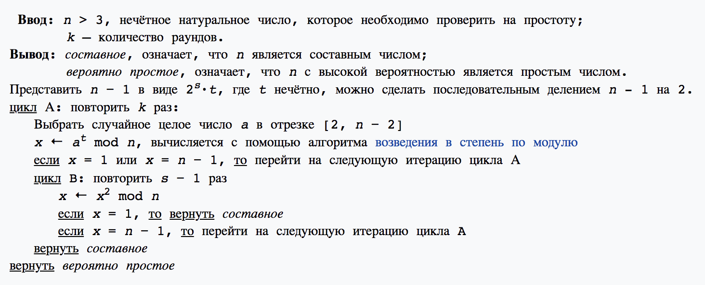{ #fig:007 width=60% }

# Выполнение лабораторной работы

В соответствии с заданием, были написаны программы реализации алгоритмов проверки чисел на простоту.
Нами были рассмотрены следующие алгоритмы:

1. Тест Ферма;
2. Символ Якоби;
3. Тест Соловэя-Штрассена;
4. Тест Миллера-Рабина.

Программный код и результаты выполнения программ представлен ниже.

## Тест Ферма

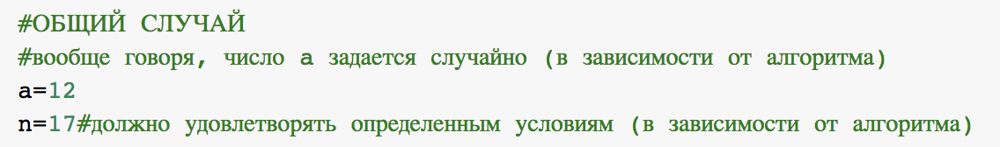{ #fig:008 width=70% }

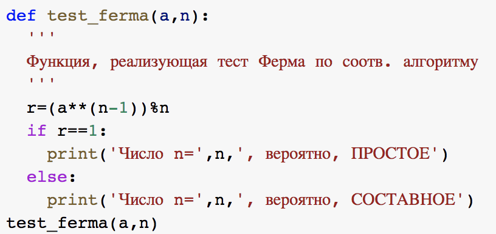{ #fig:009 width=70% }

Результаты выполнения программы представлены ниже (см. рис. [-@fig:010]).

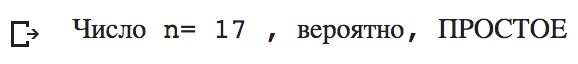{ #fig:010 width=70% }

## Символ Якоби

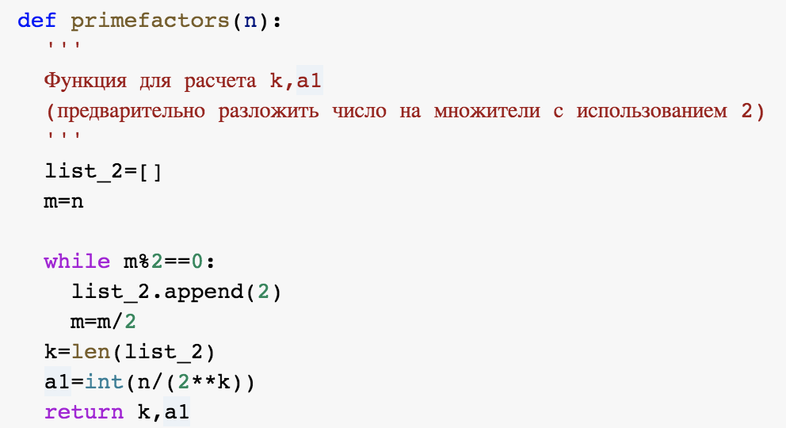{ #fig:011 width=70% }

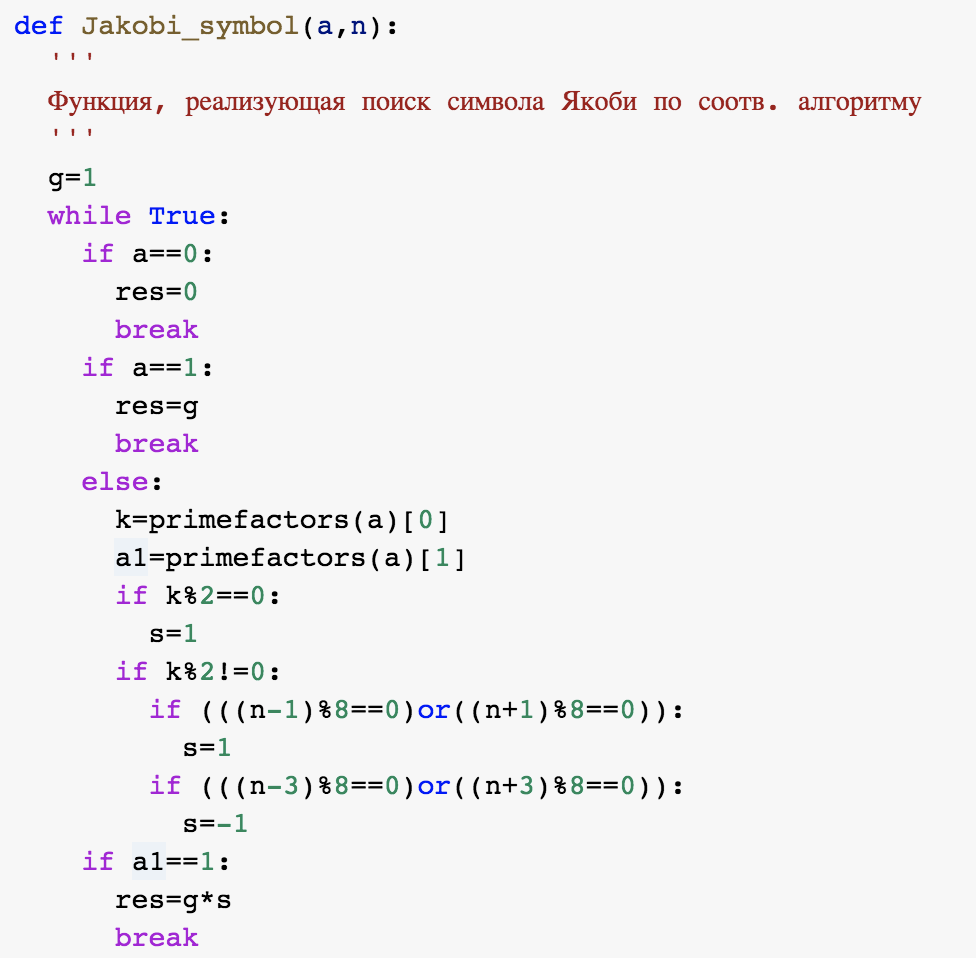{ #fig:012 width=70% }

{ #fig:013 width=70% }

Результаты выполнения программы представлены ниже (см. рис. [-@fig:014]).

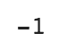{ #fig:014 width=70% }

## Тест Соловэя-Штрассена

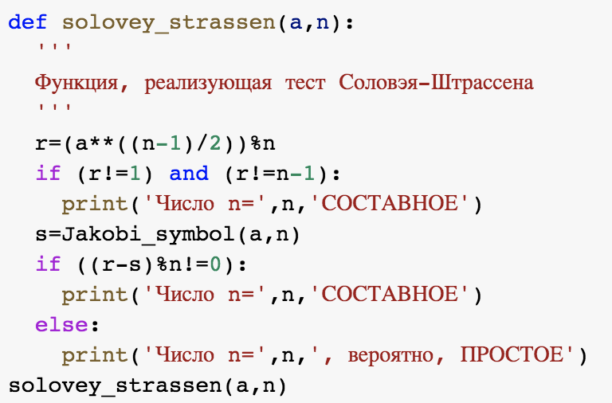{ #fig:015 width=70% }

Результаты выполнения программы представлены ниже (см. рис. [-@fig:016]).

{ #fig:016 width=70% }

## Тест Миллера-Рабина

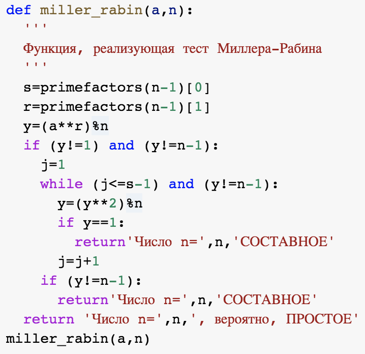{ #fig:017 width=70% }

Результаты выполнения программы представлены ниже (см. рис. [-@fig:018]).

{ #fig:018 width=70% }

# Выводы

Таким образом, была достигнута цель, поставленная в начале лабораторной работы: я ознакомилась с алгоритмами проверки чисел на простоту, -- а так же реализовала данные алгоритмы на языке программирования Python 3.

# Список литературы

1. https://ru.wikipedia.org/wiki/Тест_Ферма
2. https://ru.wikipedia.org/wiki/Символ_Якоби
3. https://ru.wikipedia.org/wiki/Тест_Соловея_—_Штрассена
4. https://ru.wikipedia.org/wiki/Тест_Миллера_—_Рабина