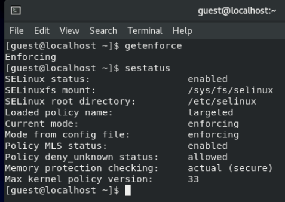
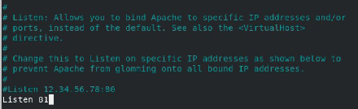

---
## Front matter
lang: ru-RU
title: Лабораторная №6
subtitle: Основы информационной безопасности
author:
  - Банникова Екатерина Алексеевна
institute:
  - Российский университет дружбы народов, Москва, Россия
  - НПМбд-01-19

## i18n babel
babel-lang: russian
babel-otherlangs: english

## Formatting pdf
toc: false
toc-title: Содержание
slide_level: 2
aspectratio: 169
section-titles: true
theme: metropolis
header-includes:
 - \metroset{progressbar=frametitle,sectionpage=progressbar,numbering=fraction}
 - '\makeatletter'
 - '\beamer@ignorenonframefalse'
 - '\makeatother'
---

# Мандатное разграничение прав в Linux

## Цель лабораторной работы

* Получить практические навыки администрирования
* Ознакомиться с технологией SELinux1

## Задачи лабораторной работы

1. Запустить веб-сервер Apache
2. Создать файл test.html
3. Изменить контексты и порт прослушивания

## Выполнение

Вход в систему с полученными учётными данными. Проверка, что SELinux работает в режиме enforcing политики targeted с помощью команд getenforce и sestatus.
  
{ #fig:1 width=50% }

## Выполнение

Обращение с помощью браузера к веб-серверу
  
{ #fig:2 width=40% }

## Выполнение
  
Обратилась к файлу через веб-сервер, введя в браузере адрес http://127.0.0.1/test.html

{ #fig:3 width=50% }

## Выполнение
  
Меняем конекст файла text.html. Перезагружаем страницу в веб-браузере.

{ #fig:4 width=50% }

## Выполнение

Установила веб-сервер Apache на прослушивание TCP-порта 81, изменяя строку Listen

{ #fig:5 width=50% }

## Выполнение

Установила порт и посмотрела список доступных

{ #fig:6 width=70% }

## Выполнение

Просматриваем файл test.html в веб-браузере

{ #fig:7 width=60% }

## Выводы

* Развила навыки администрирования ОС Linux. 
* Проверила работу SELinx на практике совместно с веб-сервером Apache.
  
  

