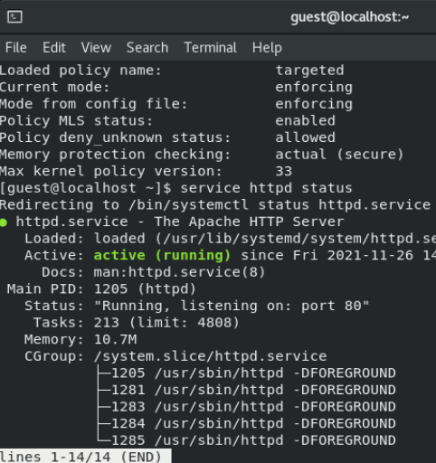
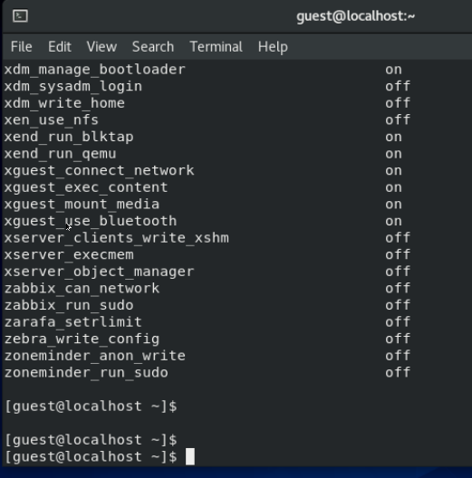
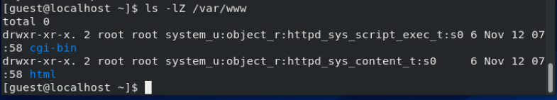
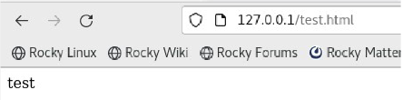
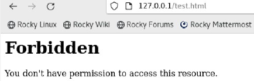

---
# Front matter
title: "Лабораторная работа №6"
subtitle: "Информационная безопасность"
author: "Банникова Екатерина Алексеевна"

## Generic otions
lang: ru-RU
toc-title: "Содержание"

## Bibliography
bibliography: bib/cite.bib
csl: pandoc/csl/gost-r-7-0-5-2008-numeric.csl

## Pdf output format
toc: true # Table of contents
toc-depth: 2
lof: true # List of figures
lot: true # List of tables
fontsize: 12pt
linestretch: 1.5
papersize: a4
documentclass: scrreprt
## I18n polyglossia
polyglossia-lang:
  name: russian
  options:
	- spelling=modern
	- babelshorthands=true
polyglossia-otherlangs:
  name: english
## I18n babel
babel-lang: russian
babel-otherlangs: english
## Fonts
mainfont: PT Serif
romanfont: PT Serif
sansfont: PT Sans
monofont: PT Mono
mainfontoptions: Ligatures=TeX
romanfontoptions: Ligatures=TeX
sansfontoptions: Ligatures=TeX,Scale=MatchLowercase
monofontoptions: Scale=MatchLowercase,Scale=0.9
## Biblatex
biblatex: true
biblio-style: "gost-numeric"
biblatexoptions:
  - parentracker=true
  - backend=biber
  - hyperref=auto
  - language=auto
  - autolang=other*
  - citestyle=gost-numeric
## Pandoc-crossref LaTeX customization
figureTitle: "Рис."
tableTitle: "Таблица"
listingTitle: "Листинг"
lofTitle: "Список иллюстраций"
lotTitle: "Список таблиц"
lolTitle: "Листинги"
## Misc options
indent: true
header-includes:
  - \usepackage{indentfirst}
  - \usepackage{float} # keep figures where there are in the text
  - \floatplacement{figure}{H} # keep figures where there are in the text
---

# Цель работы

Развить навыки администрирования ОС Linux. Получить первое практическое знакомство с технологией SELinux1. 
Проверить работу SELinx на практике совместно с веб-сервером Apache.

# Теоретическое введение

# Выполнение лабораторной работы

Вошла в систему с полученными учётными данными и убедилась, что SELinux работает в режиме enforcing политики targeted с помощью команд getenforce и sestatus.

{ #fig:1 width=70% }

Обратилась с помощью браузера к веб-серверу, запущенному на компьютере, и убедилась, что последний работает:
service httpd status
или
/etc/rc.d/init.d/httpd status

{ #fig:2 width=70% }

Нашла веб-сервер Apache в списке процессов, определила его контекст безопасности и занесла эту информацию в отчёт. 

{ #fig:3 width=70% }

Посмотрела текущее состояние переключателей SELinux для Apache с помощью команды sestatus -bigrep httpd

{ #fig:4 width=70% }

Посмотрела статистику по политике с помощью команды seinfo, также определила множество пользователей, ролей, типов.

{ #fig:5 width=70% }

Определила тип файлов и поддиректорий, находящихся в директории /var/www, с помощью команды ls -lZ /var/www

{ #fig:6 width=70% }

Определила тип файлов, находящихся в директории /var/www/html: ls -lZ /var/www/html

{ #fig:7 width=70% }

Определила круг пользователей, которым разрешено создание файлов в директории /var/www/html.

{ #fig:8 width=70% }

Создала от имени суперпользователя (так как в дистрибутиве после установки только ему разрешена запись в директорию) html-файл. Проверила контекст созданного файла. 

Обратилась к файлу через веб-сервер, введя в браузере адрес http://127.0.0.1/test.html. Убедилась, что файл был успешно отображён

{ #fig:9 width=70% }

Изучила справку man httpd_selinux и выяснила, какие контексты файлов определены для httpd. Сопоставила их с типом файла
test.html. Изменила контекст файла /var/www/html/test.html 

Попробовала ещё раз получить доступ к файлу через веб-сервер, введя в браузере адрес http://127.0.0.1/test.html. Получила сообщение об ошибке:

{ #fig:10 width=70% }

Проанализировала ситуацию. Почему файл не был отображён, если права доступа позволяют читать этот файл любому пользователю?
Просмотрела log-файлы веб-сервера Apache.

Установила веб-сервер Apache на прослушивание TCP-порта 81, изменяя строку Listen

{ #fig:11 width=70% }

Перезапустила сервер и посмотрела данные log-файлов веб-сервера Apache. Установила для веб-сервера Apache порт TCP-81 и проверила его наличие

{ #fig:12 width=70% }

Попробовала запустить веб-сервер Apache ещё раз.

{ #fig:13 width=70% }

Удалила привязку http_port_t к 81 порту. Удалила файл test.html

# Выводы

Развила навыки администрирования ОС Linux. Получила первое практическое знакомство с технологией SELinux1. 
Проверила работу SELinx на практике совместно с веб-сервером Apache.
