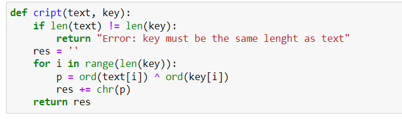
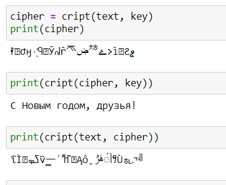

---
# Front matter
title: "Лабораторная работа №7"
subtitle: "Информационная безопасность"
author: "Банникова Екатерина Алексеевна"

## Generic otions
lang: ru-RU
toc-title: "Содержание"

## Bibliography
bibliography: bib/cite.bib
csl: pandoc/csl/gost-r-7-0-5-2008-numeric.csl

## Pdf output format
toc: true # Table of contents
toc-depth: 2
lof: true # List of figures
lot: true # List of tables
fontsize: 12pt
linestretch: 1.5
papersize: a4
documentclass: scrreprt
## I18n polyglossia
polyglossia-lang:
  name: russian
  options:
	- spelling=modern
	- babelshorthands=true
polyglossia-otherlangs:
  name: english
## I18n babel
babel-lang: russian
babel-otherlangs: english
## Fonts
mainfont: PT Serif
romanfont: PT Serif
sansfont: PT Sans
monofont: PT Mono
mainfontoptions: Ligatures=TeX
romanfontoptions: Ligatures=TeX
sansfontoptions: Ligatures=TeX,Scale=MatchLowercase
monofontoptions: Scale=MatchLowercase,Scale=0.9
## Biblatex
biblatex: true
biblio-style: "gost-numeric"
biblatexoptions:
  - parentracker=true
  - backend=biber
  - hyperref=auto
  - language=auto
  - autolang=other*
  - citestyle=gost-numeric
## Pandoc-crossref LaTeX customization
figureTitle: "Рис."
tableTitle: "Таблица"
listingTitle: "Листинг"
lofTitle: "Список иллюстраций"
lotTitle: "Список таблиц"
lolTitle: "Листинги"
## Misc options
indent: true
header-includes:
  - \usepackage{indentfirst}
  - \usepackage{float} # keep figures where there are in the text
  - \floatplacement{figure}{H} # keep figures where there are in the text
---

# Цель работы

Освоить основы шифрования через однократное гаммирование

# Теоретическое введение

# Выполнение лабораторной работы

Лабораторная выполнена на языке Python 3 в среде Jupiter Notebook. Создаем функцию, которая осуществляет однократное гаммирование посредством побитового XOR

{ #fig:1 width=70% }

Задаем текстовую строку и создаем случайный символьный ключ такой длины

{ #fig:2 width=70% }

Запускаем функцию. В первом случае получаем зашифрованный текст. Используя тот же ключ, осуществляем дешифровку текста. Зная оригинальный текст и его шифровку, может получить ключ.
Все эти действия осуществляются через одну и ту же функцию

{ #fig:3 width=70% }

# Выводы

Я освоила на практике применение режима однократного гаммирования.

