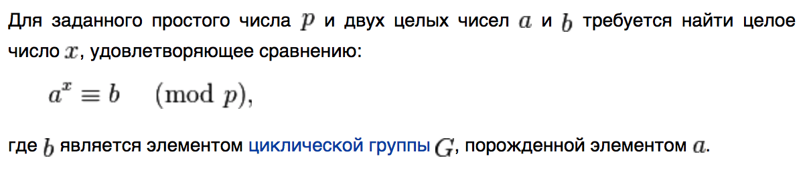
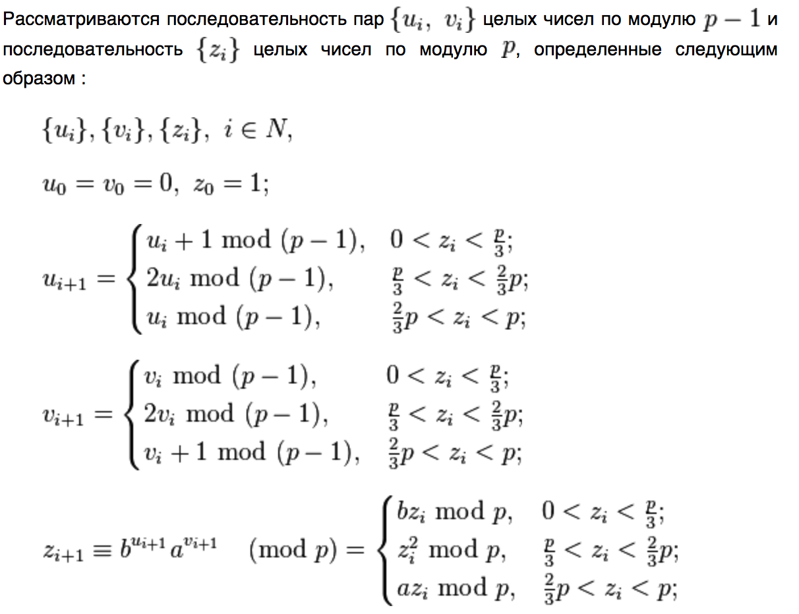
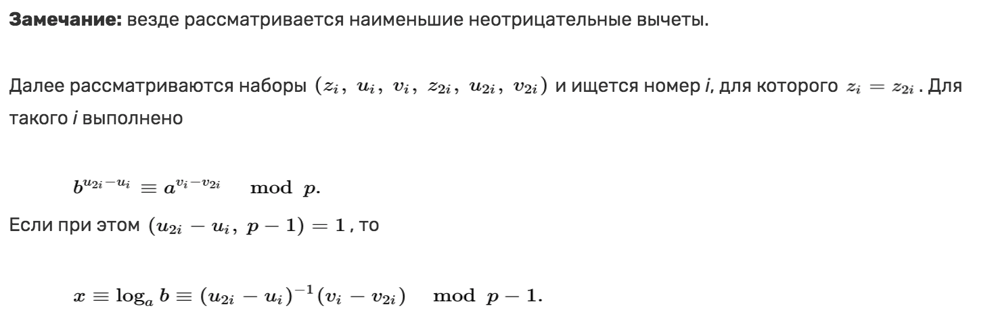
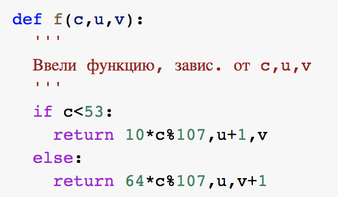
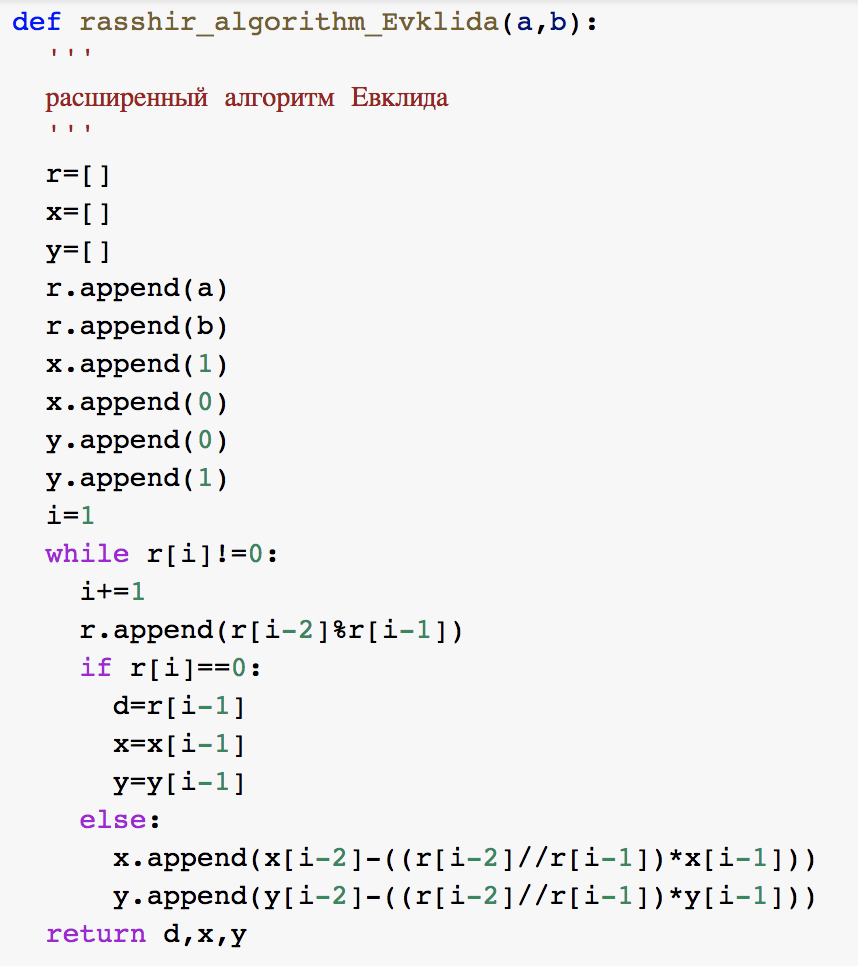
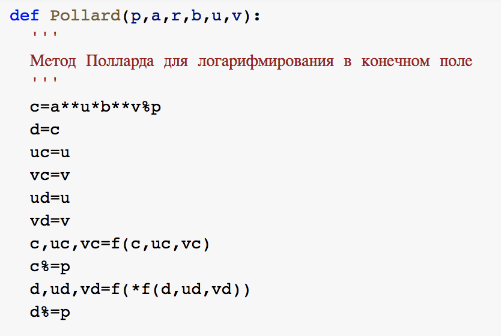
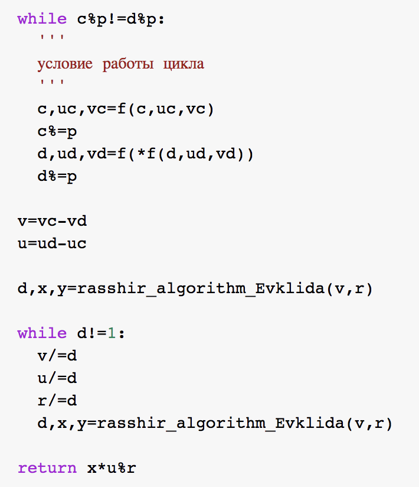
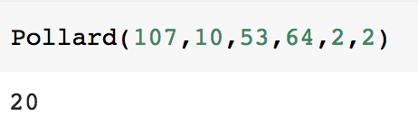

---
# Титульный лист
title: |
    Лабораторная работа №7.  
    Дискретное логарифмирование в конечном поле
author:
- "Студентка: Царитова Нина Аведиковна"
- "Группа: НФИмд-02-23"
- "Преподаватель: Кулябов Дмитрий Сергеевич,"
- "д-р.ф.-м.н., проф."

# Общие опции
lang: ru-RU
toc-title: "Содержание"

# Библиография
bibliography: bib/cite.bib
csl: pandoc/csl/gost-r-7-0-5-2008-numeric.csl

# Конвертация в ПДФ
toc: true # Содержание
toc_depth: 2
lof: true # Список изображений
lot: true # Список таблиц
fontsize: 12pt
linestretch: 1.5
papersize: a4
documentclass: scrreprt

## I18n
polyglossia-lang:
  name: russian
  options:
	- spelling=modern
	- babelshorthands=true
polyglossia-otherlangs:
  name: english
### Шрифты
mainfont: PT Serif
romanfont: PT Serif
sansfont: PT Sans
monofont: PT Mono
mainfontoptions: Ligatures=TeX
romanfontoptions: Ligatures=TeX
sansfontoptions: Ligatures=TeX,Scale=MatchLowercase
monofontoptions: Scale=MatchLowercase,Scale=0.8
## Biblatex
biblatex: true
biblio-style: "gost-numeric"
biblatexoptions:
  - parentracker=true
  - backend=biber
  - hyperref=auto
  - language=auto
  - autolang=other*
  - citestyle=gost-numeric

## Misc options
indent: true
header-includes:
  - \linepenalty=10 # the penalty added to the badness of each line within a paragraph (no associated penalty node) Increasing the value makes tex try to have fewer lines in the paragraph.
  - \interlinepenalty=0 # value of the penalty (node) added after each line of a paragraph.
  - \hyphenpenalty=50 # the penalty for line breaking at an automatically inserted hyphen
  - \exhyphenpenalty=50 # the penalty for line breaking at an explicit hyphen
  - \binoppenalty=700 # the penalty for breaking a line at a binary operator
  - \relpenalty=500 # the penalty for breaking a line at a relation
  - \clubpenalty=150 # extra penalty for breaking after first line of a paragraph
  - \widowpenalty=150 # extra penalty for breaking before last line of a paragraph
  - \displaywidowpenalty=50 # extra penalty for breaking before last line before a display math
  - \brokenpenalty=100 # extra penalty for page breaking after a hyphenated line
  - \predisplaypenalty=10000 # penalty for breaking before a display
  - \postdisplaypenalty=0 # penalty for breaking after a display
  - \floatingpenalty = 20000 # penalty for splitting an insertion (can only be split footnote in standard LaTeX)
  - \raggedbottom # or \flushbottom
  - \usepackage{float} # keep figures where there are in the text
  - \floatplacement{figure}{H} # keep figures where there are in the text

  - \usepackage{titling}
  - \setlength{\droptitle}{-9em}
  - \pretitle{\begin{center}
      \textbf{РОССИЙСКИЙ УНИВЕРСИТЕТ ДРУЖБЫ НАРОДОВ}\\
      \textbf{Факультет физико-математических и естественных наук}\\
      \textbf{Кафедра прикладной информатики и теории вероятностей}
      \vspace{9cm}
      \LARGE\\}
  - \posttitle{\vskip 1em \Large \emph{\textit{Дисциплина$:$ Математические основы защиты информации и информационной безопасности}} \end{center}}
  - \preauthor{\vskip 3em \begin{flushright} \large \begin{tabular}[t]{c}}
  - \postauthor{\end{tabular}\par\end{flushright} \vfill \vskip 5em}
---

# Цель работы

Целью данной лабораторной работы является ознакомление с алгоритмом, реализующим Po-метод Полларда для дискретного логарифмирования, а также программное воплощение данного алгоритма.

# Задание

1. Реализовать рассмотренный в инструкции к лабораторной работе алгоритм программно.

2. Подставить численное значение из примера в программный код, проверить правильность полученного ответа.

# Теоретическое введение

В данной лабораторной работе предметом нашего изучения стал Pо-метод Полларда для задач дискретного логарифмирования.

## Po-метод Полларда

Ро-метод Полларда для дискретного логарифмирования ($\rho$ -метод) — алгоритм дискретного логарифмирования в кольце вычетов по простому модулю, имеющий экспоненциальную сложность. Предложен британским математиком Джоном Поллардом  в 1978 году, основные идеи алгоритма очень похожи на идеи ро-алгоритма Полларда для факторизации чисел. Данный метод рассматривается для группы ненулевых вычетов по модулю p, где p — простое число, большее 3.

## Постановка задачи дискретного логарифмирования

Постановка задачи дискретного логарифмирования представлена следующим образом:

{ #fig:001 width=70% }

## Алгоритм Ро-метода Полларда

Исходя из теоретических сведений, алгоритм Ро-метода Полларда представлен ниже.

{ #fig:002 width=70% }

При этом, важно учесть следующие замечания [@mind:pol]:

{ #fig:003 width=70% }

## Сложность алгоритма

Эвристическая оценка сложности составляет $O ({p}^{1/2})$.

# Выполнение лабораторной работы

В соответствии с заданием, была написана программа по воплощению алгоритма Ро-метода Полларда для задач дискретного логарифмирования.

Программный код и результаты выполнения программ представлен ниже.

## Pо-метод Полларда

{ #fig:004 width=70% }

{ #fig:005 width=70% }

{ #fig:006 width=70% }

{ #fig:007 width=70% }

{ #fig:008 width=70% }

# Выводы

Таким образом, была достигнута цель, поставленная в начале лабораторной работы: в результате выполнения данной лабораторной работы нам удалось изучить алгоритм Po-Полларда осуществить программно алгоритм, рассмотренный в описании к лабораторной работе на языке Python 3. А также получить ответ, совпадающий с ответом из инструкции.

# Список литературы{.unnumbered}

1. https://ru.wikipedia.org/wiki/Ро-метод_Полларда_для_дискретного_логарифмирования
