---
## Front matter
lang: ru-RU
title: |
    Лабораторная работа №8.  
    Целочисленная арифметика многократной точности
author: |
    *Дисциплина: Математические основы защиты информации*  
    *и информационной безопасности*  
    \vspace{2pt}
    Студентка: Царитова Нина Аведиковна 
		Группа: НФИмд-02-23  
		Преподаватель: д-р.ф.-м.н., проф. Кулябов Дмитрий Сергеевич
    \vspace{2pt}

## Formatting
toc: false
slide_level: 2
theme: metropolis
header-includes:
 - \metroset{progressbar=frametitle,sectionpage=progressbar,numbering=fraction}
 - '\makeatletter'
 - '\beamer@ignorenonframefalse'
 - '\makeatother'
aspectratio: 43
section-titles: true
linestretch: 1.25

mainfont: PT Serif
romanfont: PT Serif
sansfont: PT Sans
monofont: PT Mono
mainfontoptions: Ligatures=TeX
romanfontoptions: Ligatures=TeX
sansfontoptions: Ligatures=TeX,Scale=MatchLowercase
monofontoptions: Scale=MatchLowercase,Scale=0.7
---

# Цели и задачи работы

## Цель лабораторной работы

\centering \Large \textbf{Целью} данной лабораторной работы является ознакомление с алгоритмами по воплощению целочисленной арифметики многократной точности, а также программная реализация данных алгоритмов.

## Задание

Реализовать рассмотренные в инструкции к лабораторной работе алгоритмы программно.

Алгоритмы:

1. Сложение неотрицательных целых чисел

2. Вычитание неотрицательных целых чисел

3. Умножение неотрицательных целых чисел столбиком

4. Быстрый столбик

5. Деление многоразрядных целых чисел

# Ход выполнения и результаты

## Вспомогательные действия

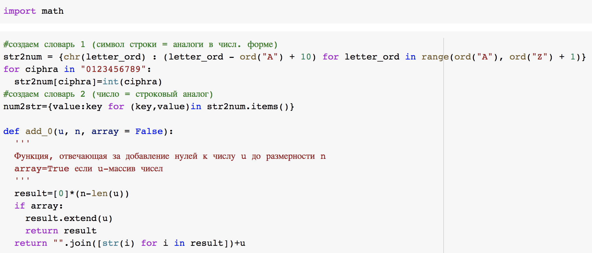{ #fig:001 width=70% }

## Алгоритм 1. Сложение неотрицательных целых чисел. Реализация

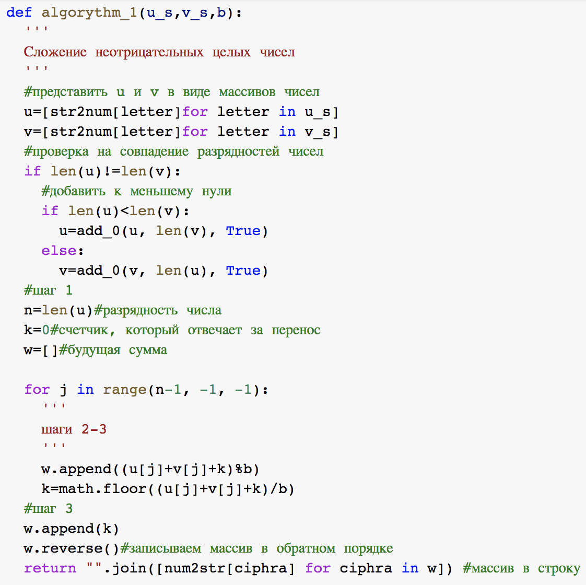{ #fig:002 width=70% }

## Алгоритм 1. Сложение неотрицательных целых чисел. Результат

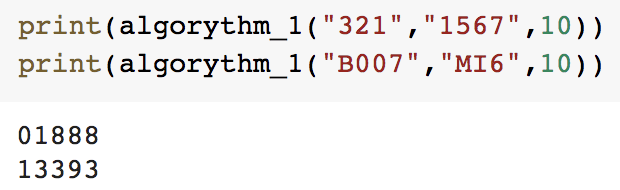{ #fig:003 width=70% }

## Алгоритм 2. Вычитание неотрицательных целых чисел. Реализация

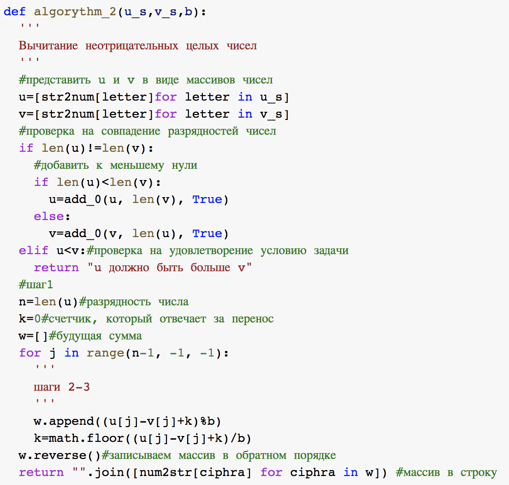{ #fig:004 width=70% }

## Алгоритм 2. Вычитание неотрицательных целых чисел. Результат

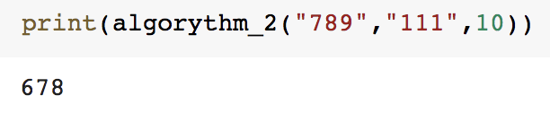{ #fig:005 width=70% }

## Алгоритм 3. Умножение неотрицательных целых чисел столбиком. Реализация

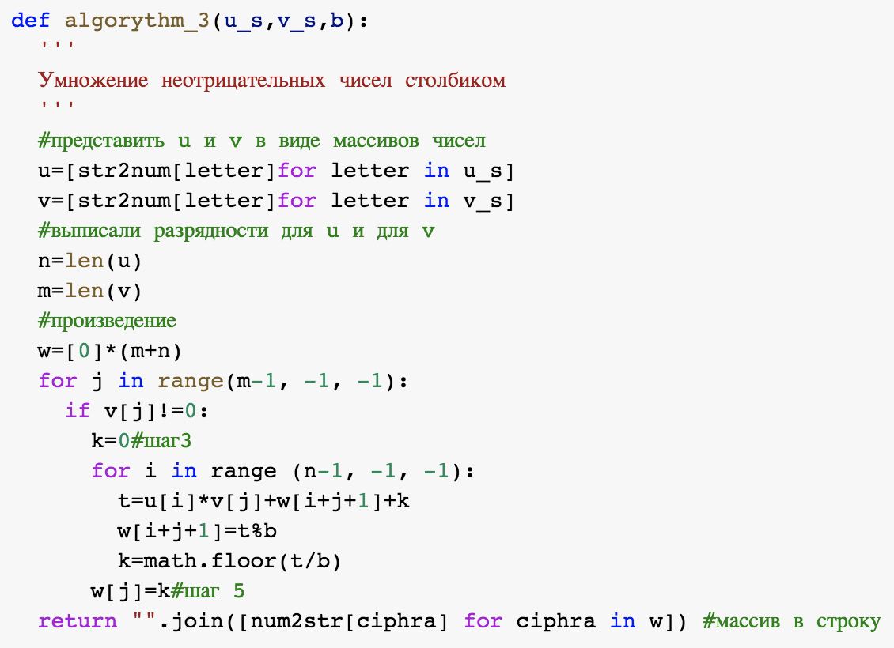{ #fig:006 width=70% }

## Алгоритм 3. Умножение неотрицательных целых чисел столбиком. Результат

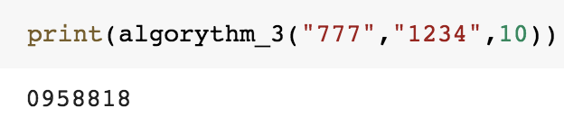{ #fig:007 width=70% }

## Алгоритм 4. Быстрый столбик. Реализация

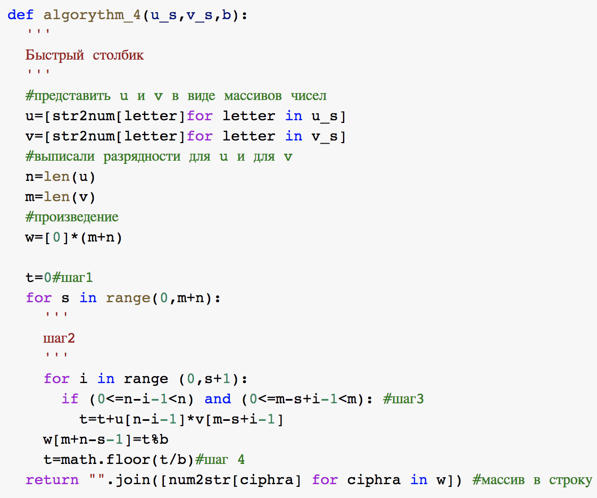{ #fig:008 width=70% }

## Алгоритм 4. Быстрый столбик. Результат

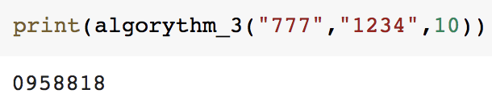{ #fig:009 width=70% }

## Алгоритм 5. Деление многоразрядных целых чисел. Реализация

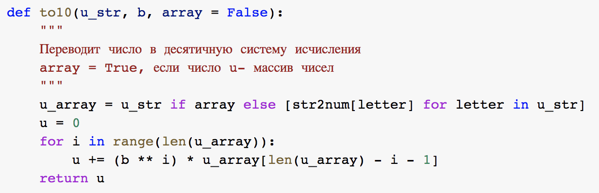{ #fig:010 width=70% }

## Алгоритм 5. Деление многоразрядных целых чисел. Реализация

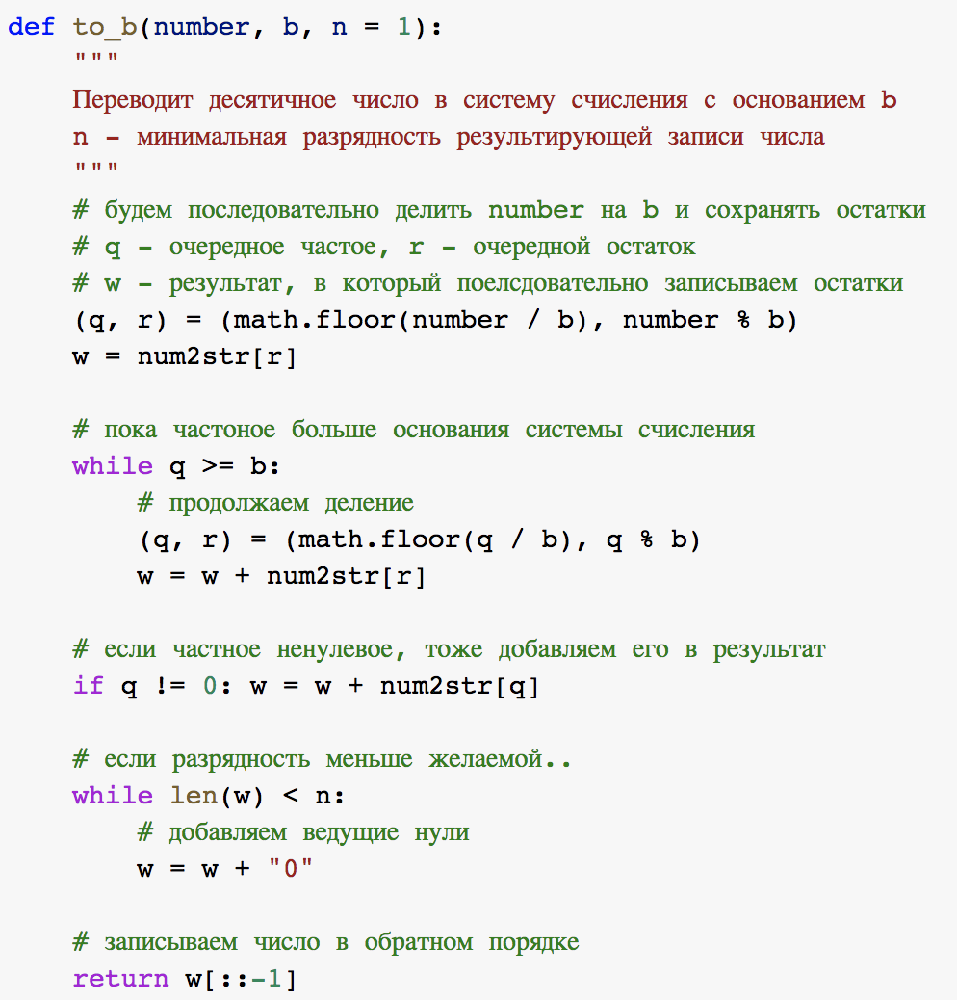{ #fig:011 width=30% }

## Алгоритм 5. Деление многоразрядных целых чисел. Реализация

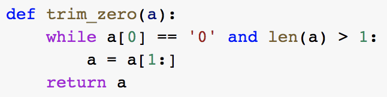{ #fig:012 width=70% }

## Алгоритм 5. Деление многоразрядных целых чисел. Реализация

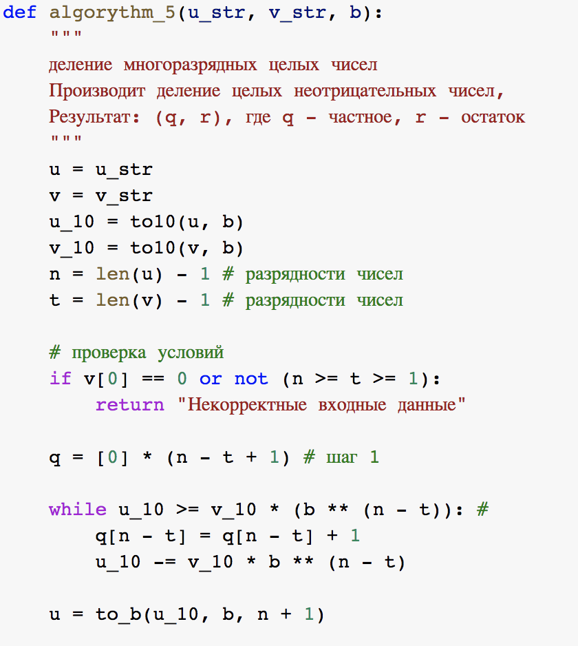{ #fig:013 width=30% }

## Алгоритм 5. Деление многоразрядных целых чисел. Реализация

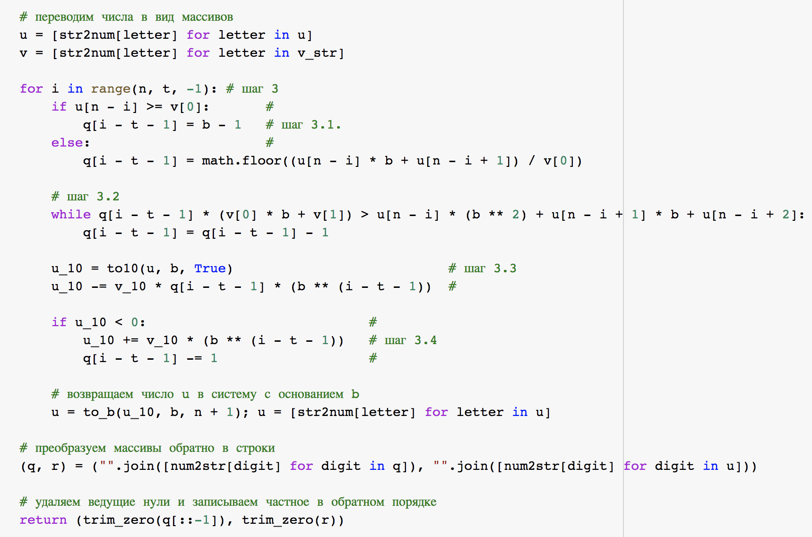{ #fig:014 width=20% }

## Алгоритм 5. Деление многоразрядных целых чисел. Результат

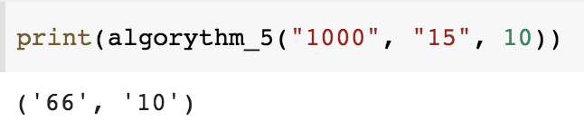{ #fig:015 width=70% }

## Вывод

В результате выполнения данной лабораторной работы нам удалось осуществить программно алгоритмы, рассмотренные в описании к лабораторной работе. 

