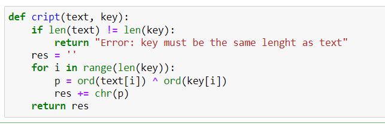
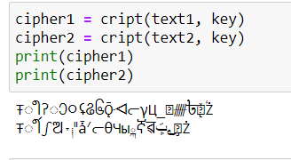
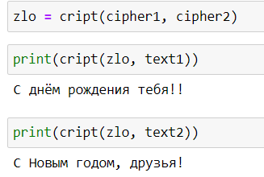

---
## Front matter
lang: ru-RU
title: Лабораторная №8
subtitle: Основы информационной безопасности
author:
  - Банникова Екатерина Алексеевна
institute:
  - Российский университет дружбы народов, Москва, Россия
  - НПМбд-01-19

## i18n babel
babel-lang: russian
babel-otherlangs: english

## Formatting pdf
toc: false
toc-title: Содержание
slide_level: 2
aspectratio: 169
section-titles: true
theme: metropolis
header-includes:
 - \metroset{progressbar=frametitle,sectionpage=progressbar,numbering=fraction}
 - '\makeatletter'
 - '\beamer@ignorenonframefalse'
 - '\makeatother'
---

# Элементы криптографии. Шифрование различных исходных текстов одним ключом

## Цель лабораторной работы

* Освоить на практике применение однократного гаммирования при работе с различными текстами на одном ключе.

## Задачи лабораторной работы

1. Написать функцию, осуществляющую однократного гаммирования
2. Зашифровать два исходных текста
3. Определить способ, при котором злоумышленник может получить данные, не зная ключа

## Выполнение

Создаем функцию, которая осуществляет однократное гаммирование посредством побитового XOR

{ #fig:1 width=60% }

## Выполнение

Задаем две равные по длине текстовые строки и создаем случайный символьный ключ такой же длины
  
{ #fig:2 width=40% }

## Выполнение
  
Осуществляем шифрование двух текстов по ключу с помощью написанной функции

{ #fig:3 width=55% }

## Выполнение

Создаем переменную, которая, прогнав два шифрованных текста через побитый XOR, поможет злоумышлинику получить один текс, зная другой, без ключа

{ #fig:4 width=35% }

## Выполнение

Таким же способом можно получить часть данных

{ #fig:5 width=45% }

## Выводы

Освоено на практике применение режима однократного гаммирования при работе с несколькими текстами.
  

